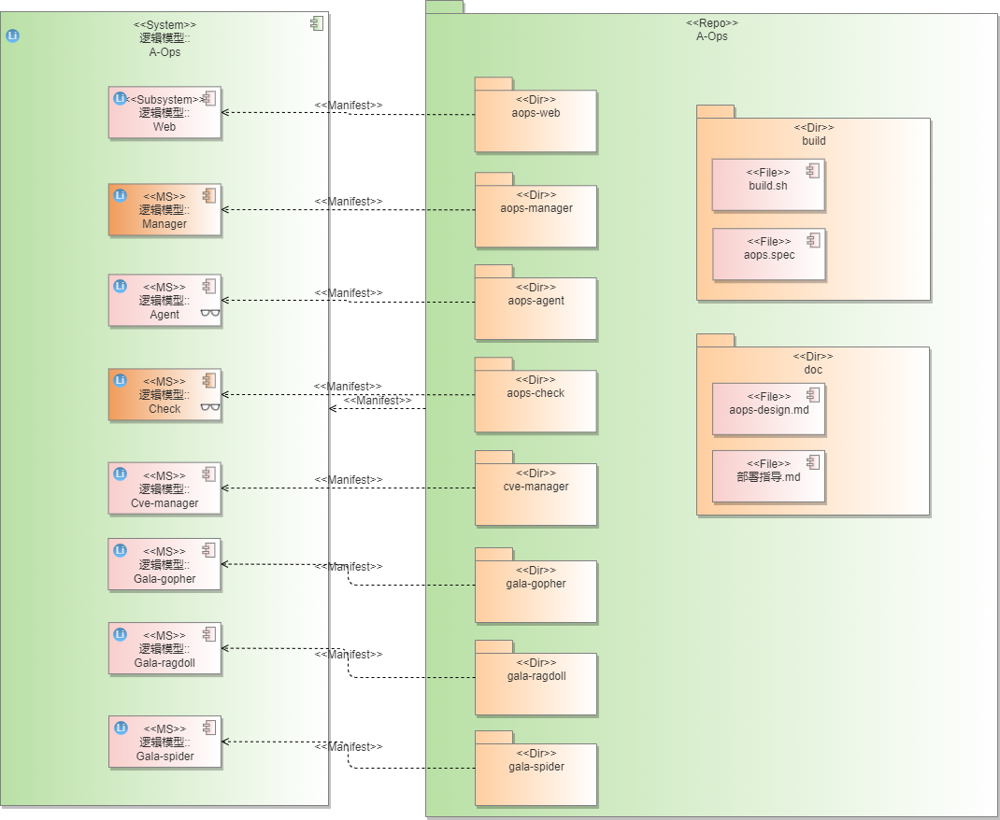
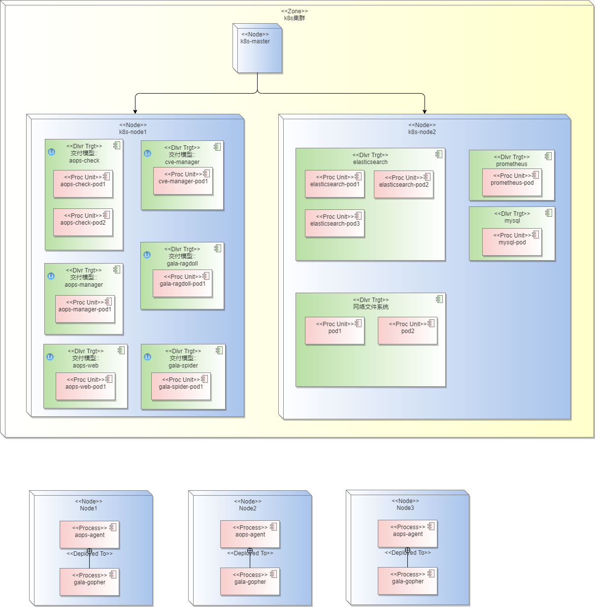

# 1、需求描述
​	Gartner通过对市场的分析：企业要求降低运维成本，另一方面运营复杂度却越来越高。运营的复杂性可以从体积、种类和速度三个维度上定义：IT基础设施和应用产生的数据量快速增长（每年增长2 ~3倍）；机器和人类产生的数据类型种类越来越多，指标、日志、线路数据和文档等。Gartner预计在未来五年，通过应用大数据和机器学习技术来分析服务的有效性，实现跨域分析可视，从而提高事件和问题参与度的AIOps。
​	从公有云和FusionServer统计的问题分布看，配置错误问题占比50%以上，居高不下。需要维护工具对配置错误快速排障。随着海量应用大量从x86平台向鲲鹏平台迁移，势必会出现各种各样的兼容性问题，性能问题，稳定性问题。对于鲲鹏水平解决方案，如大数据，分布式存储，数据库，HPC等方案，更需要能够可靠的部署在鲲鹏平台上。一旦出现问题，需要尽可能快速的对故障进行定界定位。
​	智能运维工具从如上问题出发，第一期预计实现智能运维基本框架，提供配置溯源，架构感知，故障定位基础能力，支持快速排障和运维成本降低。

## 1.1、受益人
| 角色     | 角色描述                                               |
| :------- | :----------------------------------------------------- |
| 运维人员 | 负责机器运维管理的人员                                 |
| 普通用户 | 个体用户，注册服务后，依赖于该系统对自己的机器进行监控 |

## 1.3、依赖组件
| 组件          | 组件描述 | 可获得性 |
| :------------ | :------- | :------- |
| kafka         |          |          |
| zookeeper     |          |          |
| fluentd       |          |          |
| elasticsearch |          |          |
| prometheus    |          |          |
| mysql         |          |          |

## 1.3、License

Mulan V2

# 2、架构目标
## 2.1、架构目标
各服务间解耦，通过restful或rpc方式进行通信，并能快速扩展服务；

能通过增加服务实例提升系统性能，支持动态伸缩；

对部署节点上的资源占用有限制；

服务有保活机制；

## 2.2、关键架构需求
_该模块的关键需求，作为对架构设计要求的输入_
| 需求名称            | 需求描述 | 需求类别 | 需求优先级 |
| :------------------ | :------- | :------- | :--------- |
| 支持应用快速部署    |          | _功能_   |            |
| 支持网页操作        |          | _功能_   |            |
| 支持主机数据采集    |          | _功能_   |            |
| 支持主机管理        |          | _功能_   |            |
| 支持网络异常诊断    |          | _功能_   |            |
| 支持配置溯源        |          | _功能_   |            |
| 支持架构感知        |          | _功能_   |            |
| 支持cve管理         |          | _功能_   |            |
| 支持服务扩展        |          | _功能_   |            |
| 支持agent端资源控制 |          | _性能_   |            |
| 支持服务状态监控    |          | _可靠性_ |            |

## 2.3 假设和约束
_描述该模块在运行环境，软件依赖，限制条件，业界规范等方面的限制_

运行环境为局域网，因此不考虑数据库密码

## 2.4 架构原则
_制定该特性的架构设计理念，方法，规则等_
| 原则                   | 原则描述                                                     | 举例                       |
| :--------------------- | :----------------------------------------------------------- | :------------------------- |
| _单向依赖原则_         | _不同层级之间的模块，仅允许上层调用下层_                     | _反向依赖采用hook方式实现_ |
| 全面解耦原则           | 对业务进行抽象建模，业务数据与业务逻辑解耦，系统各部件间解耦 |                            |
| 服务化/组件化原则      | 以服务、数据为中心，构建服务化、组件化架构，具备灵活、按需组合的能力 |                            |
| 接口隔离及服务自治原则 | 通过接口隐藏服务/组件的实现细节，服务/组件间只能通过接口进行交互，接口契约化、标准化，跨版本兼容；服务、组件可独立发展、独立发布、独立升级；服务自治，可视、可管、可控、可测、可维、故障自愈。 |                            |
| 弹性伸缩原则           | 每个服务具备横向扩展能力，支持按需使用、自动弹性伸缩，可动态替换、灵活部署，支撑高性能、高吞吐量、高并发、高可用业务场景。 |                            |
| 安全可靠原则           |                                                              |                            |
| 持续演进原则           | 架构并非一蹴而就，需要有效地管理架构需求，持续构建和发展架构，适应业务需求变化，适时引入业界最佳实践，及时重构，确保架构生命力和竞争力 |                            |

# 3、用例视图 
## 3.1、上下文模型
_关注系统边界，定系统与外部环境的交互，定义系统的范围，职责和边界_
## 3.1.1、 上下文视图
## 3.1.2、 外部接口描述
| 接口编号 | 类型            | 接口描述       | 规格          |
| :------- | :-------------- | :------------- | :------------ |
| _模块-x_ | _消息/接口调用_ | _查询主机列表_ | _1分钟内完成_ |
|          |                 |                |               |
## 3.2、 USE-CASE模型
## 3.2.1、 USE-CASE视图
_内部实现为黑盒，识别外部功能_
_包括主要业务流图，动态视角识别功能点_

## 3.2、逻辑视图
### 3.2.1、0层逻辑模型

系统按照业务层次分为UI层、服务层、数据库层、agent层

- UI层

  A-Ops对外提供restful api接口，可结合配套的web使用，其提供了web操作界面，同样也提供了命令行接口。

- 服务层

  服务层主要为A-Ops提供的一些核心能力，包括管理服务、异常检测服务、配置溯源服务、架构感知服务、cve管理服务，其中：

  - 管理服务（Manager）负责主机节点的管理、用户信息的管理、采集数据的存储等，作为A-Ops的core服务，为其他服务提供了主机查询、命令转发等接口。
  - 异常检测服务（Check）提供对注册机器的诊断能力，通过用户配置的工作流进行定时的故障诊断，检测到异常并诊断后发送告警告知运维人员。同时也支持对算法的导入和训练，方便运维人员快速创建适合自己业务场景的诊断工作流。
  - 配置溯源服务（Gala-ragdoll）提供对注册机器的配置管理能力，能够及时感知节点的配置变化，并产生告警信息；同样能够同步配置到节点，完成配置的统一下发。
  - 架构感知服务（Gala-spider）能够感知整个集群的拓扑结构，方便用户观察，同时为故障诊断提供了拓扑信息，使其能够提升诊断的精度。
  - cve管理服务（Cve-manager）提供了cve巡检&修复功能，该功能能够定时扫描纳管主机的cve信息，并及时呈现给用户，用户可以在web界面上进行这些cve的处理。用户能够及时修复影响较大的cve，也能够评审cve的影响程度决定是否马上修复，当cve修复后出现问题也能够进行回退。

- 数据库层

  数据库层主要为A-Ops所依赖的数据库，为elasticsearch和mysql

  - elasticsearch作为分布式搜索引擎，其能够存储非结构化数据，包括配置信息及采集的日志数据，并提供高效的查询接口。
  - mysql作为关系型数据库，主要存储主机相关的信息、用户信息及告警信息。

- agent层

  agent层主要为agent服务，其运行在用户管理的主机上，负责该主机注册到manager以及一些命令的执行，同时管理当前节点上的数据采集服务，如fluentd（日志采集软件）、Gala-gopher（kpi采集服务）。

### 3.2.2、1层逻辑模型

该逻辑模型体现了各服务间的主要交互关系，从中可以看到Manager服务作为核心服务，其他服务均与其有交互，因为其负责主机信息的管理以及命令的转发，而其他服务均需要获取到主机信息，包括一些命令的下发。agent服务负责节点上采集程序的管理，数据通过kafka转发，被Manager服务消费到，随后存入数据库中。

## 3.3、开发视图

### 3.3.1、代码模型

A-Ops的每个服务均有个相应的代码目录，每个服务均可独立进行开发，目前所有的代码目录放在一个repo仓下。

代码元素清单：

| 逻辑元素     | 代码元素名称      |
| ------------ | ----------------- |
| A-Ops        | aops              |
| Web          | aops/aops-web     |
| Manager      | aops/aops-manager |
| Agent        | aops/aops-agent   |
| Check        | aops/aops-check   |
| Cve-manager  | aops/cve-manager  |
| Gala-gopher  | aops/gala-gopher  |
| Gala-ragdoll | aops/gala-ragdoll |
| Gala-spider  | aops/gala-spider  |

### 3.3.2、构建模型

构建元素清单

| 构建元素     | 构建过程     | 对应的代码元素    |
| ------------ | ------------ | ----------------- |
| aops-web     | package.json | aops/aops-web     |
| aops-manager | Dockerfile   | aops/aops-manager |
| aops-check   | Dockerfile   | aops/aops-check   |
| cve-manager  | Dockerfile   | aops/cve-manager  |
| gala-ragdoll | Dockerfile   | aops/gala-ragdoll |
| gala-spider  | Dockerfile   | aops/gala-spider  |
| aops-agent   | agent.spec   | aops/aops-agent   |
| gala-gopher  | build.sh     | aops/gala-gopher  |

## 3.4、部署视图

系统可采用k8s进行多节点部署，每个服务均有一个容器镜像，通过k8s启动管理，可以按需增加多个实例，增加实例只需新增一个pod节点即可。数据库也通过k8s进行部署，可以选择多节点和单节点。网络文件系统也通过k8s部署。若不采用k8s，也可通过部署脚本进行部署启动。

agent、gala-gopher和fluentd可手动部署到主机，也可通过ansible进行批量部署。

## 3.5、 运行视图

## 3.6、质量属性设计
### 3.6.1、性能规格
| 规格名称     | 规格指标                |
| :----------- | :---------------------- |
| 内存占用     | <100M                   |
| 启动时间     | 5s内启动                |
| 响应时间     | 2s内给出响应            |
| 管理主机规格 | 支持对1000+台主机的监控 |

### 3.6.2、系统可靠性设计

1. **异常情况**：

   使用k8s进行管理服务，服务可由多个pod组成，一个pod的崩溃对服务的运行无影响。

2. **数据库**：

   系统增加定时任务，在指定的时间段内，对系统中的数据做备份，默认保留最近1周的数据，便于后期恢复，该周期可配置 。

3. **集群部署**

   支持服务的集群部署，服务均可通过扩展多实例，借由k8s进行负载均衡。

### 3.6.3、安全性设计

1. **数据库权限**

   由于A-Ops支持多用户对其私人的主机/主机组进行检测和诊断，需要对不同用户的信息做隔离操作。数据库统一对用户进行了区分，即用户只能访问其相关主机的信息。

2. **用户权限问题**

   对用户不作区分，均视为管理员，不同用户之间无法进行交互，目前系统有默认的admin账户，密码为changeme，用户登陆后获取到token，后续通过token进行相应权限识别。

3. **文件权限问题**

   采用权限最小化策略，代码开发完成后补充相关文件的权限设计

4. **restful接口安全**

   发送请求时使用token进行身份验证，使用https服务确保请求参数被加密，后端接收请求后对接口参数做每个参数类型的校验。

5. **命令注入问题**

   命令行操作，入参会做校验，而且后台为解析参数后调用url接口，不存在入参拼接命令执行操作，所以不存在命令注入问题。

### 3.6.4、兼容性设计

1. 服务对外接口使用restful接口，对外接口只能增量变化，新版本保证旧版本接口可用。
2. 对于底层缓存，数据库的变更，对外不体现，由代码逻辑保证可用性。

### 3.6.5、可服务性设计

待考虑

### 3.6.6、可测试性设计

待考虑

## 3.7、特性清单
| no   | 特性描述      | 代码估计规模 | 实现版本 |
| :--- | :------------ | :----------- | :------- |
| 1    | web操作界面   |              |          |
| 2    | agent         |              |          |
| 3    | 主机/用户管理 |              |          |
| 4    | 异常检测      |              |          |
| 5    | 配置溯源      |              |          |
| 6    | 架构感知      |              |          |
| 7    | kpi数据采集   |              |          |

## 3.8、接口清单

见每个特性设计文档

# 4、修改日志
| 版本 | 发布说明 |作者|
| :---- | :------- | :---|
| 1.0  | openEuler22.09版本aops整体架构设计文档，每个模块设计见各自的特性设计文档   | luoshengwei@huawei.com|
|      |          ||

# 5、参考目录