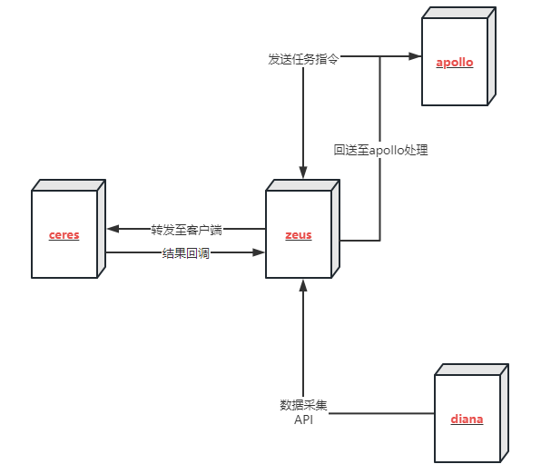

## A-Ops开发手册

智能定位Aops项目采用Restful API +Vue实现前后端分离，后端Api使用flask+flask-restful对外提供api接口，具体微服务之间调用关系如下所示：



- **apollo:** 漏洞管理服务，监控机器漏洞并提供修复/回退功能

- **zeus:** 主机和用户管理器服务，它是aop的基础服务
- **ceres:** 一个需要在客户端采用的代理，它管理一些插件，如gala-gopher(kpi收集)、fluentd(日志收集)、补丁修复/回退等
- **diana:** 智能工作流框架，用户可以自定义自己的异常检测(算法、训练、预测、诊断等)，并且可以通过默认的诊断工作流直接启用该服务

> 以上除了ceres客户端外，其他服务都依赖于 **aops-vulcanus**工具包，下面将重点介绍工具包整体结构

### 1. aops-vulcanus

#### 1.1 目录结构

```
├── aops-vulcanus
├── aops-vulcanus.spec
├── conf
│   └── system.ini
├── LICENSE
├── README.en.md
├── README.md
├── scripts
│   └── deploy
│       ├── ansible_handler
│       │   ├── playbooks
│       │   │   └── aops_agent.yml
│       │   └── roles
│       │       └── aops_agent
│       │           ├── tasks
│       │           │   ├── config_aops_agent.yml
│       │           │   ├── install_aops_agent.yml
│       │           │   ├── main.yml
│       │           │   └── start_aops_agent.yml
│       │           └── templates
│       │               ├── agent.conf.j2
│       │               └── register.json.j2
│       ├── aops-basedatabase.sh
│       ├── build_inventory.py
│       ├── conf
│       │   ├── import_host.xls
│       │   └── inventory_config.yml
│       ├── container
│       │   ├── aops-apollo
│       │   │   ├── Dockerfile
│       │   │   └── start.sh
│       │   ├── aops-diana
│       │   │   ├── Dockerfile
│       │   │   └── start.sh
│       │   ├── aops-zeus
│       │   │   ├── Dockerfile
│       │   │   └── start.sh
│       │   ├── conf
│       │   │   ├── aops-install.repo
│       │   │   ├── apollo.ini
│       │   │   ├── diana.ini
│       │   │   ├── prometheus.yml
│       │   │   └── zeus.ini
│       │   ├── docker-compose-base-service.yml
│       │   ├── docker-compose.yml
│       │   ├── hermes
│       │   │   ├── default.conf
│       │   │   └── Dockerfile
│       │   ├── mysql
│       │   │   ├── Dockerfile
│       │   │   └── init.sql
│       │   ├── README.md
│       │   └── run.sh
│       ├── deploy-aops.sh
│       ├── install-aops-service.sh
│       ├── install_aops.sh
│       └── README.md
├── setup.py
└── vulcanus
    ├── cli_utils.py
    ├── compare.py
    ├── conf
    │   ├── constant.py
    │   ├── default_config.py
    │   ├── __init__.py
    ├── database
    │   ├── helper.py
    │   ├── __init__.py
    │   ├── proxy.py
    │   └── table.py
    ├── excel2dict
    │   ├── diag_tree_dict.py
    │   ├── __init__.py
    ├── __init__.py
    ├── kafka
    │   ├── consumer.py
    │   ├── __init__.py
    │   ├── kafka_exception.py
    │   ├── producer.py
    ├── log
    │   ├── __init__.py
    │   ├── log.py
    ├── manage.py
    ├── multi_thread_handler.py
    ├── preprocessing
    │   ├── alignment.py
    │   ├── deduplicate.py
    │   ├── __init__.py
    ├── readconfig.py
    ├── restful
    │   ├── helper.py
    │   ├── __init__.py
    │   ├── resp
    │   │   ├── __init__.py
    │   │   ├── map.xml
    │   │   ├── state.py
    │   │   └── xmlmap.py
    │   ├── response.py
    │   └── serialize
    │       ├── __init__.py
    │       └── validate.py
    ├── send_email.py
    ├── singleton.py
    ├── tests
    │   ├── __init__.py
    ├── time_utils.py
    ├── token.py
    └── validate.py
```

#### 1.2 文件说明

| 目录/文件名                      | 功能                                                         |
| -------------------------------- | ------------------------------------------------------------ |
| aops-vulcanus                    | vulcanus的shell脚本，提供uwsgi服务配置文件生成、检查配置项、mysql和elasticsearch安装检查 |
| aops-vulcanus.spec               | aops-vulcanus生成rpm包时的spec文件，当有新版本迭代时，应同步更新此文件 |
| conf/system.ini                  | aops服务的公共配置项                                         |
| conf/.aops-private-conf.ini      | aops服务的个性化配置，包含邮箱、第三方授权、私钥等用户自定义配置项 |
| scripts/container                | aops服务容器化部署方案（一键化部署），采用docker+docker-compose技术，每次版本迭代后，需同步更新aops-install.repo源 |
| scripts/container/run.sh         | 一键化部署启动脚本，分别提供基础服务、aops服务的启动/停止    |
| vulcanus/conf/constant.py        | 工具包类的常量定义                                           |
| vulcanus/conf/default_config.py  | 系统级公用的默认配置项                                       |
| vulcanus/database/helper.py      | 数据库服务中创建引擎链接、分页排序、创建表等                 |
| vulcanus/database/proxy.py       | 数据库公共链接服务，提供统一的调用方式，包含mysql、elasticsearch、redis等 |
| vulcanus/kafka                   | kafka类型消息通知的封装，包含生产和消费                      |
| vulcanus/log                     | aops服务的日志封装，统一日志打印格式                         |
| vulcanus/manage.py               | apollo、zeus、diana服务的初始化入口，提供统一的配置注册、url注册等 |
| vulcanus/multi_thread_handler.py | 多线程/进程统一调用入口                                      |
| vulcanus/restful/response.py     | restful服务的基类，包含请求参数验证、token验证、http请求等   |
| vulcanus/restful/resp            | 对请求响应的统一封装，包含统一的状态码、响应内容等           |
| vulcanus/send_email.py           | 发送邮件                                                     |
| vulcanus/singleton.py            | 单例模式装饰器                                               |
| vulcanus/token.py                | 基于jwt的token生成和解析                                     |
| vulcanus/tests                   | 工具包的单元测试用例目录                                     |

### 2. aops-apollo

#### 2.1 目录结构

```
├── aops-apollo
├── aops-apollo.repo
├── aops-apollo.service
├── aops-apollo.spec
├── aops-apollo-tool
│   ├── aops_apollo_tool
│   │   ├── gen_updateinfo.py
│   │   └── __init__.py
│   ├── setup.py
│   └── updateinfo_config.ini
├── apollo
│   ├── conf
│   │   ├── constant.py
│   │   ├── default_config.py
│   │   ├── __init__.py
│   ├── cron
│   │   ├── download_sa_manager.py
│   │   ├── __init__.py
│   │   ├── manager
│   │   │   ├── __init__.py
│   │   │   ├── parse_config_info.py
│   │   ├── timed_correct_manager.py
│   │   └── timed_scan_task.py
│   ├── database
│   │   ├── __init__.py
│   │   ├── mapping.py
│   │   ├── proxy
│   │   │   ├── cve.py
│   │   │   ├── host.py
│   │   │   ├── __init__.py
│   │   │   ├── repo.py
│   │   │   └── task.py
│   │   └── table.py
│   ├── function
│   │   ├── cache.py
│   │   ├── customize_exception.py
│   │   ├── __init__.py
│   │   ├── schema
│   │   │   ├── cve.py
│   │   │   ├── host.py
│   │   │   ├── __init__.py
│   │   │   ├── repo.py
│   │   │   └── task.py
│   │   └── utils.py
│   ├── handler
│   │   ├── cve_handler
│   │   │   ├── __init__.py
│   │   │   ├── manager
│   │   │   │   ├── compress_manager.py
│   │   │   │   ├── __init__.py
│   │   │   │   ├── parse_advisory.py
│   │   │   │   ├── parse_unaffected.py
│   │   │   │   ├── save_to_csv.py
│   │   │   │   └── srcpackage_whitelist.py
│   │   │   └── view.py
│   │   ├── host_handler
│   │   │   ├── __init__.py
│   │   │   └── view.py
│   │   ├── __init__.py
│   │   ├── repo_handler
│   │   │   ├── helper.py
│   │   │   ├── __init__.py
│   │   │   └── view.py
│   │   └── task_handler
│   │       ├── cache.py
│   │       ├── callback
│   │       │   ├── cve_fix.py
│   │       │   ├── cve_rollback.py
│   │       │   ├── cve_scan.py
│   │       │   ├── __init__.py
│   │       │   └── repo_set.py
│   │       ├── config.py
│   │       ├── __init__.py
│   │       ├── manager
│   │       │   ├── cve_fix_manager.py
│   │       │   ├── cve_rollback_manager.py
│   │       │   ├── __init__.py
│   │       │   ├── repo_manager.py
│   │       │   └── scan_manager.py
│   │       └── view.py
│   ├── __init__.py
│   ├── manage.py
│   ├── tests
│   │   ├── __init__.py
│   └── url.py
├── conf
│   ├── apollo_crontab.ini
│   └── apollo.ini
├── doc
│   └── design
│       ├── 接口变更文档22.03-LTS-SP2.md
│       ├── 接口变更文档-23.03.md
│       ├── 热补丁需求release-plan.md
│       ├── aops-apollo接口文档.yaml
│       ├── aops-apollo数据库设计.sql
│       ├── aops-apollo特性设计文档(draft-for-hotpatch).md
│       ├── aops-apollo特性设计文档.md
├── Dockerfile
├── hotpatch
│   ├── baseclass.py
│   ├── hotpatch.py
│   ├── hotpatch_updateinfo.py
│   ├── hot-updateinfo.py
│   ├── hotupgrade.py
│   ├── syscare.py
│   └── test_syscare.py
├── LICENSE
├── README.en.md
├── README.md
└── setup.py
```

#### 2.2 文件说明

| 目录/文件名              | 功能                                                         |
| ------------------------ | ------------------------------------------------------------ |
| aops-apollo              | apollo服务启动/暂停入口                                      |
| aops-apollo.service      | 提供apollo服务支持systemctl管理                              |
| aops-apollo.spec         | aops-apollo生成rpm包时的spec文件，当有新版本迭代时，应同步更新此文件 |
| aops-apollo-tool         | 生成系统补丁包工具                                           |
| apollo/conf              | apollo服务的常量定义及系统启动时的默认配置项                 |
| apollo/cron              | 定时任务，包含定时下载安全公告、定时校正数据、定时扫描漏洞   |
| apollo/database/table.py | apollo服务中涉及的数据表结构定义                             |
| apollo/database/proxy    | 业务数据处理逻辑，包含任务、repo、主机、cve等                |
| apollo/function          | 对外API的请求体参数验证（schema）                            |
| apollo/handler           | API对外访问的View视图层，包含cve、host、repo、task等，其中task_handler中包含了callback任务回调和任务管理 |
| apollo/manage.py         | API服务管理，提供app服务初始化                               |
| apollo/tests             | apollo服务的单元测试用例目录                                 |
| apollo/conf              | apollo服务配置项，包含了服务配置项（apollo.ini）和定时任务配置项（apollo_crontab.ini） |
| apollo/doc/design        | 需求设计文档（api接口文档、数据库设计文档）                  |
| apollo/hotpatch          | dnf的热补丁插件相关                                          |

#### 2.3 配置新增

当服务中的配置不能满足后续业务需求时，可在以下两个文件中增加服务配置项

> **conf/apollo.ini**

```ini
[apollo]
ip=127.0.0.1
port=11116
host_vault_dir=/opt/aops
host_vars=/opt/aops/host_vars

[zeus]
ip=127.0.0.1
port=11111

; hermes info is used to send mail.
[hermes]
ip=127.0.0.1
port=8000

[cve]
cve_fix_function=yum
# value between 0-23, for example, 2 means 2:00 in a day.
cve_scan_time=2

[mysql]
ip=127.0.0.1
port=3306
database_name=aops
engine_format=mysql+pymysql://@%s:%s/%s
pool_size=100
pool_recycle=7200

[elasticsearch]
ip=127.0.0.1
port=9200
max_es_query_num=10000000

[redis]
ip=127.0.0.1
port=6379

[uwsgi]
wsgi-file=manage.py
daemonize=/var/log/aops/uwsgi/apollo.log
http-timeout=600
harakiri=600
processes=1
gevent=100

```

> **apollo/conf/default_config.py**

```python
apollo = {
    "IP": "127.0.0.1",
    "PORT": 11116,
    "HOST_VAULT_DIR": "/opt/aops",
}

cve = {
    "CVE_FIX_FUNCTION": "yum",
    "CVE_SCAN_TIME": 2
}

mysql = {
    "IP": "127.0.0.1",
    "PORT": 3306,
    "DATABASE_NAME": "aops",
    "ENGINE_FORMAT": "mysql+pymysql://@%s:%s/%s",
    "POOL_SIZE": 100,
    "POOL_RECYCLE": 7200
}

elasticsearch = {
    "IP": "127.0.0.1",
    "PORT": 9200,
    "MAX_ES_QUERY_NUM": 10000000
}

zeus = {
    "IP": "127.0.0.1",
    "PORT": 11111
}

redis = {
    "IP": "127.0.0.1",
    "PORT": 6379
}

hermes = {
    "IP": "127.0.0.1",
    "PORT": 8000
}
```

#### 2.4 接口变动

当有新的业务需求增加restful API时，通过以下三个步骤完成一个api的添加

- **常量中增加url地址**

​		定位至**apollo/conf/constant.py**，在文件中增加地址常量

- **handler目录下增加业务视图**

​		在**apollo/handler**目录下增加一类业务视图，例如host_handler、task_handler等

- **完成url和视图的映射**

​		同步修改**apollo/url.py**文件，增加视图和url地址常量的映射关系

**例如：**

```python
# xxxSchema: api请求体参数，需要对数据做有效性校验
# xxxProxy：数据处理业务逻辑
# config：服务的配置项，当需要有数据业务处理时，默认必传
class xxxApi(BaseResponse):
    
    @BaseResponse.handle(schema=xxxSchema, proxy=xxxProxy, config=configuration)
    def post(self, callback: xxxProxy, **params):

        return self.response(code=status_code, data=data)

```

### 3. aops-zeus

#### 3.1 目录结构

```
├── aops-zeus
├── aops-zeus.service
├── aops-zeus.spec
├── conf
│   └── zeus.ini
├── doc
│   └── design
│       ├── 接口变动文档2304.md
│       ├── aops架构设计文档.md
│       ├── aops-update版本特性说明文档2304.zip
│       ├── aops-zeus接口文档.yaml
├── LICENSE
├── README.en.md
├── README.md
├── setup.py
└── zeus
    ├── account_manager
    │   ├── cache.py
    │   ├── __init__.py
    │   ├── key.py
    │   └── view.py
    ├── agent_manager
    │   ├── __init__.py
    │   └── view.py
    ├── conf
    │   ├── constant.py
    │   ├── default_config.py
    │   ├── __init__.py
    ├── config_manager
    │   ├── __init__.py
    │   └── view.py
    ├── database
    │   ├── __init__.py
    │   ├── proxy
    │   │   ├── account.py
    │   │   ├── host.py
    │   │   ├── __init__.py
    │   │   ├── metric.py
    ├── function
    │   ├── __init__.py
    │   ├── model.py
    │   └── verify
    │       ├── account.py
    │       ├── agent.py
    │       ├── config.py
    │       ├── host.py
    │       ├── __init__.py
    │       ├── metric.py
    │       └── vulnerability.py
    ├── host_manager
    │   ├── __init__.py
    │   ├── ssh.py
    │   └── view.py
    ├── __init__.py
    ├── manage.py
    ├── metric_manager
    │   ├── __init__.py
    │   └── view.py
    ├── tests
    │   ├── __init__.py
    ├── url.py
    └── vulnerability_manage
        ├── __init__.py
        └── view.py
```

#### 3.2 文件说明

| 目录/文件名          | 功能                                                         |
| -------------------- | ------------------------------------------------------------ |
| aops-zeus            | zeus服务启动/暂停入口                                        |
| aops-zeus.service    | 提供zeus服务支持systemctl管理                                |
| aops-zeus.spec       | aops-zeus生成rpm包时的spec文件，当有新版本迭代时，应同步更新此文件 |
| conf/zeus.ini        | zeus启动时的默认配置项                                       |
| doc/design           | zeus服务的需求设计、接口设计                                 |
| zeus/conf            | zeus服务的常量定义及系统启动时的默认配置项                   |
| zeus/account_manager | 基本的用户管理，包含登录、注册、第三方授权等                 |
| zeus/agent_manager   | zeus与客户端ceres交互管理                                    |
| zeus/config_manager  | zeus服务的配置项管理                                         |
| zeus/host_manager    | 主机组管理视图                                               |
| zeus/metric_manager  |                                                              |
| zeus/database/proxy  | 业务数据处理逻辑，包含用户的注册登录、主机管理、监控等       |
| zeus/function/verify | API请求体参数校验（schema）                                  |
| zeus/url.py          | zeus服务对外提供的api接口                                    |
| zeus/manage.py       | zeus服务app的初始化和管理                                    |

#### 3.3 配置新增

当服务中的配置不能满足后续业务需求时，可在以下两个文件中增加服务配置项

> **conf/zeus.ini**

```ini
[zeus]
ip=127.0.0.1
port=11111

[uwsgi]
wsgi-file=manage.py
daemonize=/var/log/aops/uwsgi/zeus.log
http-timeout=600
harakiri=600
processes=2
; if gevent is used in the project, you should set gevent item here, its value is the maximum number of coroutine
; concurrency. gevent and threads are conflicting items, and gevent is read with a higher priority than threads.
gevent=100

[mysql]
ip=127.0.0.1
port=3306
database_name=aops
engine_format=mysql+pymysql://@%s:%s/%s
pool_size=100
pool_recycle=7200

[prometheus]
ip=127.0.0.1
port=9090
query_range_step=15s

[agent]
default_instance_port=8888

[redis]
ip=127.0.0.1
port=6379

[diana]
ip=127.0.0.1
port=11112

[apollo]
ip=127.0.0.1
port=11116
```

> **apollo/conf/default_config.py**

```python
zeus = {
    "IP": "127.0.0.1",
    "PORT": 11111
}

mysql = {
    "IP": "127.0.0.1",
    "PORT": 3306,
    "DATABASE_NAME": "aops",
    "ENGINE_FORMAT": "mysql+pymysql://@%s:%s/%s",
    "POOL_SIZE": 100,
    "POOL_RECYCLE": 7200
}

diana = {
    "IP": "127.0.0.1",
    "PORT": 11112
}

apollo = {
    "IP": "127.0.0.1",
    "PORT": 11116
}

redis = {
    "IP": "127.0.0.1",
    "PORT": 6379
}

prometheus = {
    "IP": "127.0.0.1",
    "PORT": 9090,
    "QUERY_RANGE_STEP": "15s"
}

agent = {
    "DEFAULT_INSTANCE_PORT": 8888
}
```

#### 3.4 接口变动

当有新的业务需求增加restful API时，通过以下三个步骤完成一个api的添加

- **常量中增加url地址**

​		定位至**zeus/conf/constant.py**，在文件中增加地址常量

- **增加manager视图**

​		在**zeus**目录下增加一类业务视图，例如：account_manager

- **完成url和视图的映射**

​		同步修改**zeus/url.py**文件，增加视图和url地址常量的映射关系

### 4. aops-diana

#### 4.1 目录结构

```
aops-diana
├── aops-diana
├── aops-diana.repo
├── aops-diana.service
├── aops-diana.spec
├── conf
│   ├── algorithm
│   │   ├── ai_template1.json
│   │   ├── lvs_intelligent.json
│   │   ├── lvs_network_error_tree.json
│   │   ├── mysql_intelligent.json
│   │   ├── mysql_network_error_tree.json
│   │   ├── tpcc_intelligent.json
│   │   └── tpcc_network_error_tree.json
│   ├── diana_hosts.json
│   ├── diana.ini
│   └── model
│       └── intelligent
│           ├── lvs
│           │   ├── rule1_gala_gopher_cpu_net_rx
│           │   ├── rule1_gala_gopher_nic_rx_packets
│           │   └── rule2_gala_gopher_nic_tc_backlog
│           ├── mysql
│           │   ├── rule1_gala_gopher_cpu_net_rx
│           │   ├── rule1_gala_gopher_net_tcp_curr_estab
│           │   ├── rule2_gala_gopher_nic_rx_packets
│           │   └── rule2_gala_gopher_nic_tc_backlog
│           └── tpcc
│               ├── rule1_gala_gopher_cpu_net_rx
│               ├── rule1_gala_gopher_net_tcp_retrans_segs
│               └── rule2_gala_gopher_nic_tc_backlog
├── diana
│   ├── conf
│   │   ├── constant.py
│   │   ├── default_config.py
│   │   ├── __init__.py
│   ├── controllers
│   │   ├── algorithm_controller.py
│   │   ├── app_controller.py
│   │   ├── __init__.py
│   │   ├── metric_controller.py
│   │   ├── model_controller.py
│   │   ├── result_controller.py
│   │   ├── scene_controller.py
│   │   └── workflow_controller.py
│   ├── core
│   │   ├── check
│   │   │   ├── check_scheduler
│   │   │   │   ├── check_scheduler.py
│   │   │   │   ├── __init__.py
│   │   │   │   ├── task_keeper.py
│   │   │   │   └── time_keeper.py
│   │   │   ├── consumer
│   │   │   │   ├── __init__.py
│   │   │   │   └── workflow_consumer.py
│   │   │   ├── __init__.py
│   │   ├── experiment
│   │   │   ├── algorithm
│   │   │   │   ├── base_algo.py
│   │   │   │   ├── data_classification
│   │   │   │   │   ├── __init__.py
│   │   │   │   │   └── trend_ana.py
│   │   │   │   ├── diag
│   │   │   │   │   ├── __init__.py
│   │   │   │   │   └── statistic_diag.py
│   │   │   │   ├── __init__.py
│   │   │   │   ├── multi_item_check
│   │   │   │   │   ├── diagnose_by_tree.py
│   │   │   │   │   ├── diag_tree
│   │   │   │   │   │   ├── custom_exception.py
│   │   │   │   │   │   ├── __init__.py
│   │   │   │   │   │   ├── leaves
│   │   │   │   │   │   │   ├── builtin_function.py
│   │   │   │   │   │   │   ├── data_backpack.py
│   │   │   │   │   │   │   ├── element.py
│   │   │   │   │   │   │   ├── __init__.py
│   │   │   │   │   │   │   ├── leaf.py
│   │   │   │   │   │   │   ├── leaves_manager.py
│   │   │   │   │   │   │   ├── parser.py
│   │   │   │   │   │   └── tree
│   │   │   │   │   │       ├── calculation.py
│   │   │   │   │   │       ├── diag_tree.py
│   │   │   │   │   │       ├── __init__.py
│   │   │   │   │   ├── __init__.py
│   │   │   │   │   ├── intelligent.py
│   │   │   │   │   └── statistical_multi_item_check.py
│   │   │   │   ├── preprocess
│   │   │   │   │   ├── aggregate.py
│   │   │   │   │   ├── filter.py
│   │   │   │   │   ├── __init__.py
│   │   │   │   │   ├── normalize.py
│   │   │   │   │   └── train.py
│   │   │   │   ├── scene_identify
│   │   │   │   │   ├── __init__.py
│   │   │   │   │   ├── package_weight.py
│   │   │   │   └── single_item_check
│   │   │   │       ├── ewma.py
│   │   │   │       ├── __init__.py
│   │   │   │       ├── mae.py
│   │   │   │       ├── nsigma.py
│   │   │   ├── app
│   │   │   │   ├── __init__.py
│   │   │   │   ├── mysql_network_diagnose.py
│   │   │   │   ├── network_diagnose.py
│   │   │   ├── __init__.py
│   │   │   ├── model.py
│   │   ├── __init__.py
│   │   └── rule
│   │       ├── default_workflow.py
│   │       ├── functions.py
│   │       ├── __init__.py
│   │       ├── model_assign.py
│   │       └── workflow.py
│   ├── database
│   │   ├── dao
│   │   │   ├── algo_dao.py
│   │   │   ├── app_dao.py
│   │   │   ├── data_dao.py
│   │   │   ├── __init__.py
│   │   │   ├── model_dao.py
│   │   │   ├── result_dao.py
│   │   │   └── workflow_dao.py
│   │   ├── factory
│   │   │   ├── __init__.py
│   │   │   ├── mapping.py
│   │   │   └── table.py
│   │   ├── __init__.py
│   ├── errors
│   │   ├── __init__.py
│   │   ├── startup_error.py
│   │   └── workflow_error.py
│   ├── init
│   │   ├── algorithm.py
│   │   ├── app.py
│   │   ├── elasticsearch.py
│   │   ├── __init__.py
│   │   ├── mysql.py
│   ├── __init__.py
│   ├── manage.py
│   ├── mode
│   │   ├── configurable_scheduler.py
│   │   ├── default_scheduler.py
│   │   ├── executor.py
│   │   ├── __init__.py
│   │   └── scheduler.py
│   ├── models
│   │   ├── __init__.py
│   ├── tests
│   ├── url.py
│   └── utils
│       ├── conf.py
│       ├── __init__.py
│       ├── register.py
│       └── schema
│           ├── algorithm.py
│           ├── app.py
│           ├── default_mode.py
│           ├── __init__.py
│           ├── metric.py
│           ├── model.py
│           ├── result.py
│           ├── scene.py
│           └── workflow.py
├── doc
│   └── design
│       ├── aops-diana接口文档.yaml
│       ├── aops-diana数据库设计.sql
│       ├── aops-diana特性设计文档.md
├── Dockerfile
├── LICENSE
├── README.en.md
├── README.md
├── scripts
│   └── fault_inject.py
└── setup.py
```

#### 4.2 文件说明

| 文件/目录名            | 功能                                                         |
| ---------------------- | ------------------------------------------------------------ |
| diana/conf             | diana服务的常量定义及默认配置                                |
| diana/controllers      | 服务的视图层，对外提供API                                    |
| diana/core/check       | 检查调度器（check_scheduler）、工作流消费者                  |
| diana/core/experiment  | 包含算法和算法封装后的应用                                   |
| diana/core/rule        | 工作流模块，包含默认工作流和自定义工作流                     |
| diana/database/dao     | 提供业务数据查询、处理                                       |
| diana/database/factory | mysql数据库表模型、es数据存储索引                            |
| diana/init             | 包含服务初始化、mysql表构建、es数据库链接初始化等            |
| diana/mode             | diana服务启动的模式，包括配置模式、命令行执行模式            |
| diana/utils/schema     | API请求时请求体的合法性校验                                  |
| diana/url.py           | diana服务对外提供的api接口                                   |
| diana/manage.py        | diana服务app的初始化和管理                                   |
| aops-diana             | diana服务启动/暂停入口                                       |
| aops-diana.service     | 提供diana服务支持systemctl管理                               |
| aops-diana.spec        | aops-diana生成rpm包时的spec文件，当有新版本迭代时，应同步更新此文件 |

### 5. 编程规范

#### 5.1 typing

```python
from typing import Optional, Literal

def example(self, class1: Class1, strategy: Literal['s1', 's2']) -> Optional[Class2]:
```

#### 5.2 property 与slots

```python
class A:
    __slots__ = ["__a"]
    def __init__(self, a: str):
        self.__a = a
        
    @property
    def a(self) -> str:
        return self.__a
```

#### 5.3 Exception

```python
class NoEnoughRoomError(Exception):
    __slots__ = ["__room_size", "__capacity"]

    def __init__(self, room_size: int, capacity: int):
        self.__room_size = room_size
        self.__capacity = capacity

    @property
    def room_size(self) -> int:
        return self.__room_size

    @property
    def capacity(self) -> int:
        return self.__capacity

    def __repr__(self):
        return f"vehicle number {self.__room_size} has get to the max capacity {self.__capacity}"
```

#### 5.4 dataclass

```python
from dataclasses import dataclass

@dataclass
class InventoryItem:
    """Class for keeping track of an item in inventory."""
    name: str
    unit_price: float
    quantity_on_hand: int = 0
    
    def total_cost(self) -> float:
        return self.unit_price * self.quantity_on_hand
```

#### 5.5 传参少用dict

- namedtuple

- dataclass

- class

#### 5.6 import过多

```python
from typing import (
    List,
    Optional
)
```

> import内容过多时，请使用括号

#### 5.7 三段式

```python
def do_something(args):
    check_args(args)
    normal_logic()
    deviant_logic()
```

### 6. 单元测试

#### 6.1 单元测试目录结构

```txt
├── parking_log
│   ├── errors.py
│   ├── __init__.py
│   ├── manager.py
│   ├── parking_lot.py
│   └── ticket.py
└── tests
    ├── __init__.py
    ├── test_errors.py
    ├── test_manager.py
    ├── test_parking_lot.py
    └── test_ticket.py
```

#### 6.2 单元测试测哪些东西

- 参数是否正确校验

- 正常业务是否正确执行

- 异常业务是否正确执行

#### 6.3 UT如何设计

```python
def estimate_score(score: int) -> str:
    if score > 60:
        return 'good'
    return 'bad'
```

> **等价类划分:** 
>
> ​	有效等价类1: 0-59之间的任意整数
>
> ​	有效等价类2: 61-100之间的任意整数

> **边界值: **通常选取正好等于、刚刚大于、刚刚小于边界的值，作为测试数据
>
> -1,0,1,59,60,61,99,100,101

> **错误推测法**
>
> ```python
> from urllib import request
> 
> def download_file(url: str, save_file_path: str) -> bool:
>        request.urlretrieve(url, save_file_path)
>        return True
> ```

- 网络连不上

- 网络中断

- 链接不存在

- 目标磁盘不存在

- 磁盘空间不足

#### 6.4 减少数值出现

```python
class Calc:
    __slots__ = ["__configured_value"]
    
    def __init__(self):
        self.__configured_value = 1949

    @property
    def configured_value(self) -> int:
        return self.__configured_value

    def add(self, value: int) -> int:
        return self.configured_value + value
```

   

```python
import unittest
from demo.calc import Calc
import random

class CalcTestCase(unittest.TestCase):
    def test_add_value_should_get_right_result(self):
        calc = Calc()
        value = random.randint(1, 1000)
        self.assertEqual(value + 1949, calc.add(value))
```

#### 6.5 mock

- **mock open**

~~~python
class CalcTestCase(unittest.TestCase):
    def setUp(self) -> None:
        self.__configure_value = 1949
        self.__config_file = patch('builtins.open', mock_open(read_data=f"{self.__configure_value}"))
        self.__config_file.start()

    def tearDown(self) -> None:
        self.__config_file.stop()
~~~

- **request mock**

```python
class CalcTestCase(unittest.TestCase):
    def test_add_value_should_read_value_from_api_when_file_not_exists(self) -> None:
        with responses.RequestsMock() as resp:
            value = 1000
            api = "xxxx"
            resp.add(response.GET, api, body=bytes(f'{value}', encoding='utf-8'), status=200)
            self.assertEqual(xx.value, value)
```

#### 6.6 error类如何写测试用例

```python
import unittest
from unittest.mock import Mock
from parking_lot.errors import NoEnoughRoomError


class NoEnoughRoomErrorTestCase(unittest.TestCase):
    def test_get_room_size_property(self):
        room_size = Mock()
        error = NoEnoughRoomError(room_size, Mock())
        self.assertEqual(error.room_size, room_size)

    def test_get_capacity_property(self):
        capacity = Mock()
        error = NoEnoughRoomError(Mock(), capacity)
        self.assertEqual(error.capacity, capacity)

    def test_repr_should_return_correct_result(self):
        room_size = 10
        capacity = 10
        error = NoEnoughRoomError(room_size, capacity)
        self.assertEqual(repr(error), f"vehicle number 10 has get to the max capacity 10")
```

#### 6.7 单元测试命名


```shell
test_(xxx1)_should_(xxx2)_when_(xxx3)

# xxx1:api名称
# xxx2:期望的情况
# xxx3:条件

test_add_value_should_read_value_from_api_when_file_not_exists
```

### 7. 设计

#### 7.1 上下文切割

  你需要写一个程序将输入的字符串里每个英文单词出现了多少次计算出来，并且按照统计数的从大到小排列
  ```
比如：
    输入
    the the is
    得到
    the 2
    is 1
  ```

```
分层：
  非结构化数据转结构化数据    --3case
  计算词频   --2case
  按词频排序  --2case
  渲染结果 --3case
```

**测试用例数量：** 3 x 2 x 2 x 3  **>**  3 + 2 + 2 + 3

#### 7.2 原则

- 单一职责
- 里氏替换
- 依赖倒置
- 接口隔离
- 最小知识
- 开闭