# AOps资产管理使用手册

参照[AOps部署指南](deploying_aops.md)部署AOps前后端服务后，即可使用AOps资产管理功能，纳管集群主机。

主机纳管是使用AOps进行智能运维的第一步，后续用户按需部署的漏洞管理、配置溯源及故障诊断服务均面向纳管的主机进行操作。

下文将为大家介绍如何使用资产管理功能，逐步纳管集群主机。

## 1. 登录

首先使用默认的admin账号进行登录，密码为changeme

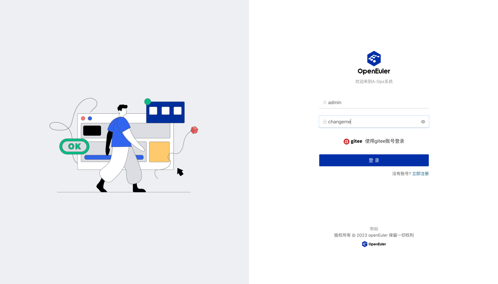

这里也支持用户注册新账号，或是用gitee账号第三方登录。

登录后会直接切入数据看板界面，后续纳管主机并漏洞扫描后，可以在右侧页面主窗口右上角内看到CVE整体数量的分布统计。

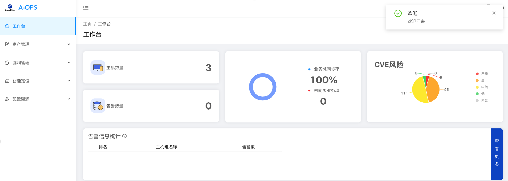

## 2. 纳管集群主机

资产管理界面用于对集群中服务器的纳管（添加、编辑和删除），支持单台主机和批量主机的添加操作。

当前资产管理模块分为以下两个界面：

- 主机管理
- 主机组管理

纳管时需先创建主机组，再将主机添加至对应主机组中，便于后续对主机分组查看和管理。

### 2.1 添加主机组

进入资产管理的主机组管理子页面，点击右侧添加主机组按钮，即可添加主机组的名称和描述。

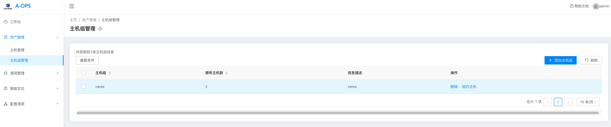

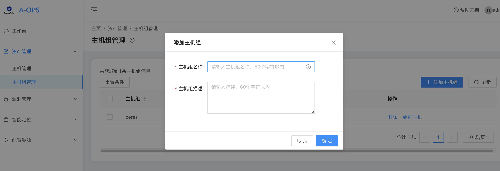

后续添加主机后，可以查看该主机组的主机列表：

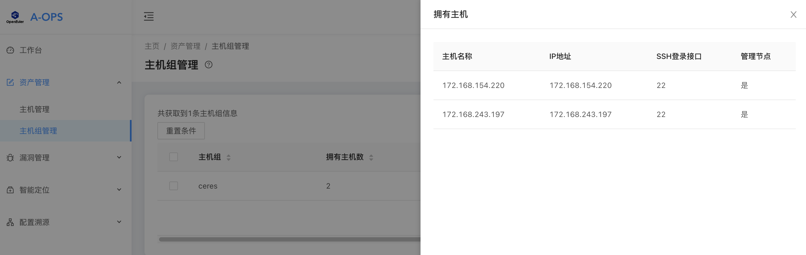

### 2.2 添加主机

进入主机管理页面，可以看到当前所有纳管的主机。其中也可以看到各主机的在线状态。

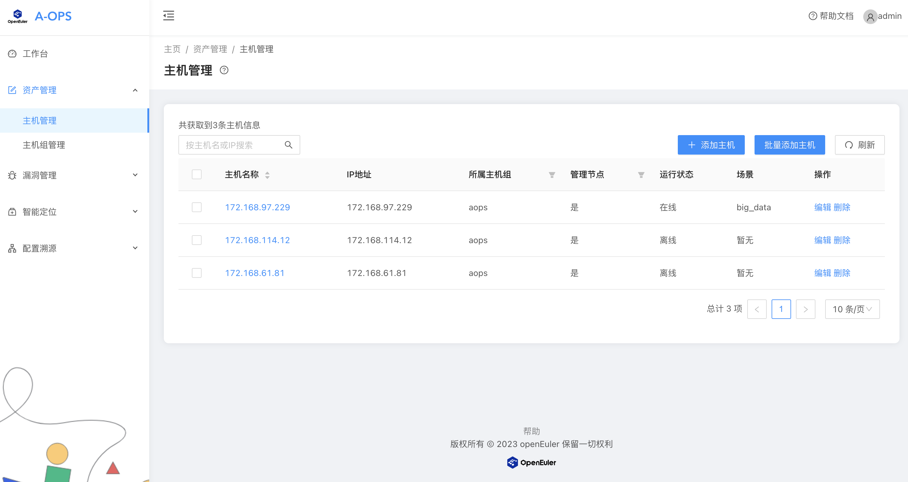

此页面支持如下操作：

- 添加单台主机
- 批量添加主机
- 主机的批量删除
- 支持使用所属主机组、管理节点的主机过滤，同时可满足对主机名称的排序

#### 2.2.1 添加单台主机

点击“添加主机”按钮，即可对单台主机进行添加。

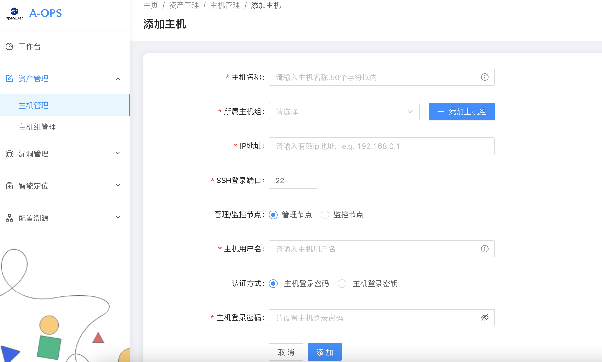

支持如下操作：

- 快捷添加主机组（同主机组管理中的添加功能）
- 登录认证方式支持主机密码模式（需提供账号和密码）和主机密钥模式（需提供可登录的密钥，**注意此处的密钥为私钥**）

注：管理节点/监控节点暂无本质区别，用户可按需指定。

#### 2.2.2 批量添加主机

针对大集群的场景，一个个添加主机过于麻烦。这里我们提供了上传excel的方式，将主机批量添加。

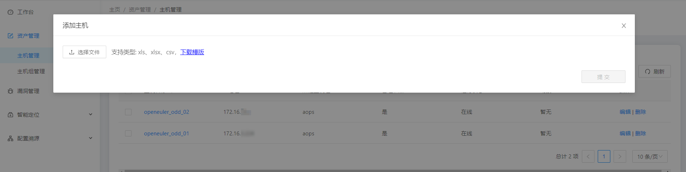

下载模板并按照格式填写主机注册所需信息后，选择文件进行上传。

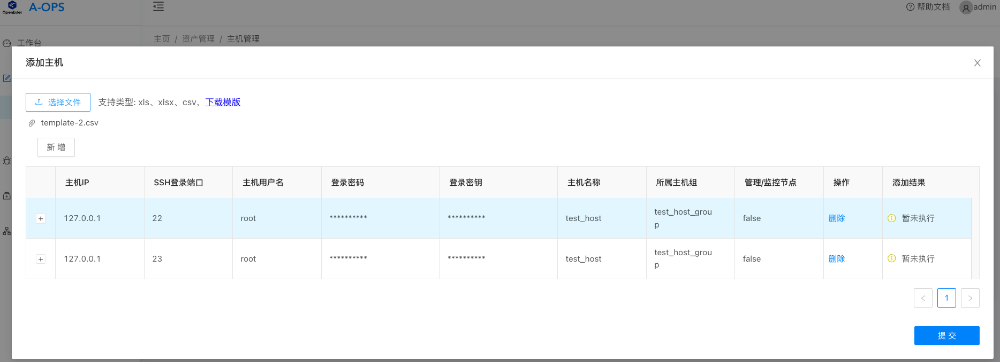

格式解析无误后，点击提交，即可看到添加结果。若添加失败会有相应提示。

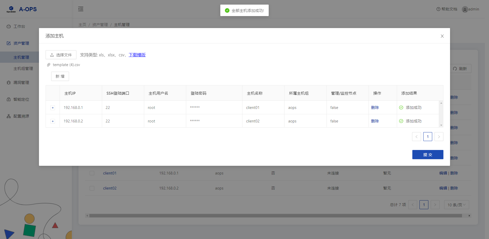

支持如下操作：

- 在线下载批量导入主机模板，支持的类型有xls、xlsx、csv三种格式的文件
- 通过新增上传解析文件内容，数据回显至前端展示
- 支持单主机的数据调整或删除
- 点击提交后，可查看主机添加的结果

## 3 编辑主机

添加主机完毕后，若密码或密钥不对导致连接失败，或其他信息需要变更，可以点击主机列表中的编辑按钮进行编辑：

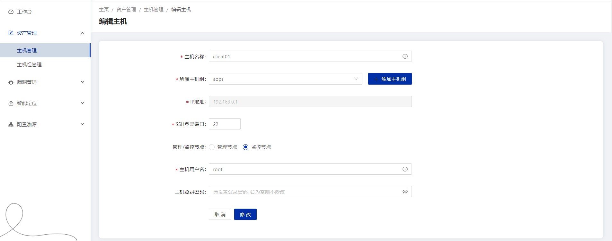

## 4 查看主机详情

客户端部署了aops-ceres命令行工具后，在主机列表点击主机可以查看该主机的一些基础信息。

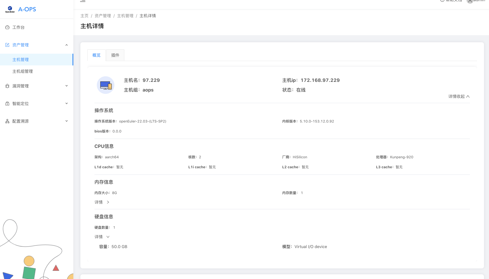

若部署了prometheus服务以及客户端的采集器（node-exporter或gala-gopher等），可以在下方选择并展示主机的指标波形。

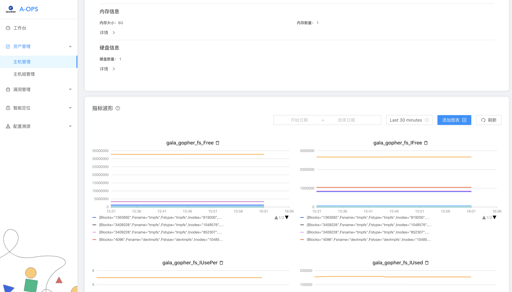

点击插件页签，可以看到node-exporter插件的各采集探针，按需开启或关闭。

点击场景识别后，系统会根据客户端的应用生成该主机的场景，并推荐检测该场景所需开启的插件以及采集项。

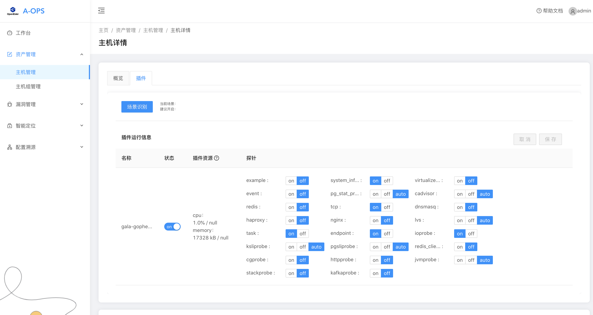
