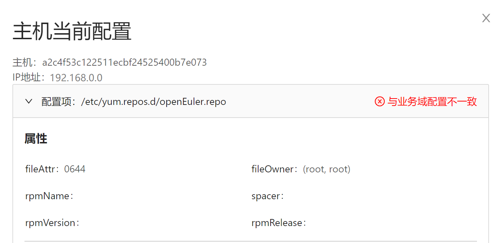

# AOps 智能定位框架使用手册

参照[AOps部署指南](deploying_aops.md)部署AOps前后端服务，并参照[AOps资产管理使用手册](./aops_asset_management_user_manual.md)纳管了主机后，即可使用AOps智能定位框架。

智能定位框架包含了**智能定位**和**配置溯源**两部分，下文会从页面的维度进行AOps智能定位框架功能的介绍。

## 1. 智能定位

AOps项目的智能定位策略采用内置网络诊断应用作为模板，生成个性化工作流的策略进行检测和诊断。

“应用”作为工作流的模板，描述了检测中各步骤的串联情况，内置各步骤中使用的检测模型的推荐逻辑。用户在生成工作流时，可根据各主机的采集项、场景等信息，定制出工作流的详细信息。

### 1.1 工作流列表页面

支持操作：

- 查看当前工作流列表，支持按照主机组、应用和状态进行筛选，并支持分页操作
- 查看当前应用列表

### 1.2 工作流详情页面

支持操作：

- 查看工作流所属主机组、主机数量、状态等基础信息
- 查看单指标检测、多指标检测、集群故障诊断各步骤的详细算法模型信息
- 修改检测各步骤应用的模型
- 执行、暂停和删除工作流

修改某检测步骤的模型时，用户可根据模型名或标签搜索系统内置的模型库，选中模型后点击右下角“应用”按钮进行更改。

### 1.3 应用详情页面

支持操作：

- 查看应用的整体流程
- 基于应用创建工作流

创建工作流时，点击右上角的“创建工作流”按钮，并在右侧弹出的窗口中输入工作流的名称和描述，选择要检测的主机组。选中主机组后，下方会列出该主机组的所有主机，用户可选中部分主机后移到右侧的列表，最后点击创建，即可在工作流列表中看到新创建的工作流。

### 1.4 告警

启动工作流后，会根据工作流的执行周期定时触发诊断，每次诊断结果若为异常，则会作为一条告警存入数据库，同时也会反映在前端告警页面中。

支持操作：

- 查看当前告警总数
- 查看各主机组的告警数量
- 查看告警列表
- 告警确认
- 查看告警详情
- 下载诊断报告

点击操作列“确认”可进行告警确认，告警确认后，将不在列表中显示

点击操作列“异常详情”后，可以根据主机维度查看告警详情，包括异常数据项的展示以及根因节点、根因异常的判断等。

## 2. 配置溯源

AOps项目的配置溯源用于对目标主机配置文件内容的变动进行检测记录，对于文件配置错误类引发的故障起到很好的支撑作用。

### 2.1 创建业务域

### 2.2 添加业务域纳管node

### 2.3 添加业务域配置

### 2.4 查询预期配置

### 2.5 删除配置

### 2.6 查询实际配置

### 2.7 配置校验

### 2.8 配置同步

暂未提供
