# AOps漏洞管理模块使用手册

参照[AOps部署指南](deploying_aops.md)部署AOps前后端服务，并参照[AOps资产管理使用手册](aops_asset_management_user_manual.md)纳管了主机后，即可使用AOps漏洞管理模块。

A-Ops智能运维工具的智能补丁管理模块(**apollo**)主要集成了**漏洞扫描、CVE修复、任务回退**、**热补丁移除**等核心功能：

- 支持对openEuler已修复并发布的漏洞进行手动/定时扫描。漏洞的详细信息通过**在线/离线**同步社区发布的安全公告进行获取。当前聚焦于内核漏洞的处理，后续支持用户态软件包漏洞。

- 支持漏洞批量修复。修复过程中，客户端会命令行调用基于dnf原生框架的dnf hotpatch插件，实现**冷补丁（需重启）/热补丁（免重启）**的修复。此插件将底层冷、热补丁的管理封装成统一的入口，方便单机用户的使用和集群的调用。

- 支持通过任务粒度回退或移除热补丁的形式，将系统恢复至原状态。

下文将按照漏洞修复的工作流来进行A-Ops智能补丁管理功能的介绍。

## 1. 配置repo源

openEuler的漏洞信息通过安全公告对外发布，同时在update源中发布修复所用的软件包及相应元数据。配置了update源后即可在命令行通过dnf updateinfo list cves命令或dnf hot-updateinfo list cves（需安装A-Ops的dnf热补丁插件）进行漏洞的扫描。

默认的openEuler系统安装后自带对应OS版本的冷补丁update源。对于自定义或离线场景，用户可以通过设置repo来自行配置冷/热补丁的update源。

### 1.1 Repo源添加

漏洞管理界面用于对目标主机存在的CVE进行监控与修复。

当前漏洞管理模块分为以下三个界面：

- 主机列表界面
- CVEs界面
- 任务列表界面

进入漏洞管理的主机管理子页面，可以从主机粒度看到当前纳管的所有主机的**已修复和未修复漏洞**情况：

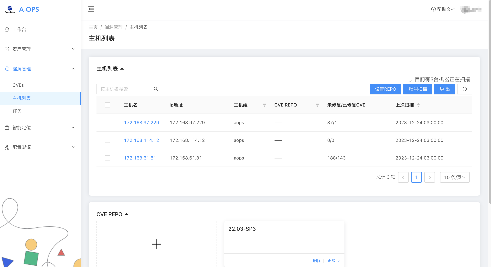

点击下方CVE REPO的加号框，随后在弹出界面中，输入REPO源名称与REPO内容，点击右下角“确定”按钮即可进行repo源的添加：

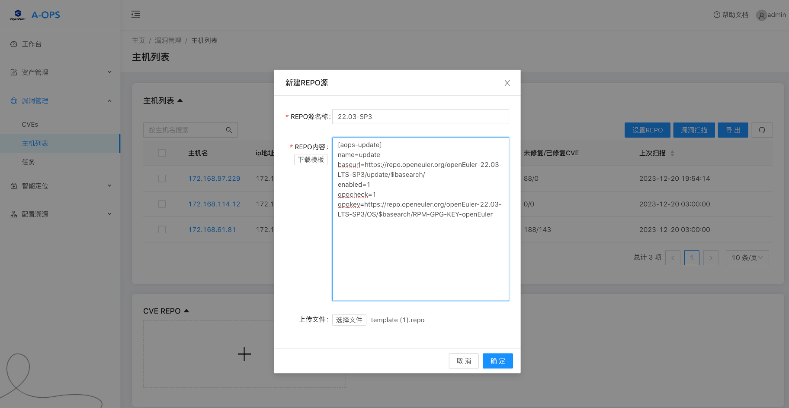

若不清楚格式，可以点击下载模板按钮查看。注意baseurl和gpgkey要配置为客户端OS版本的对应地址。用户也可以直接上传编辑好的repo文件。

新建repo完毕后，即可在CVE REPO列表中进行查看或删除。

### 1.2 Repo设置

新建repo源后，点击右上角“设置repo”的按钮，可以创建一个任务，为勾选的主机进行批量的repo设置。

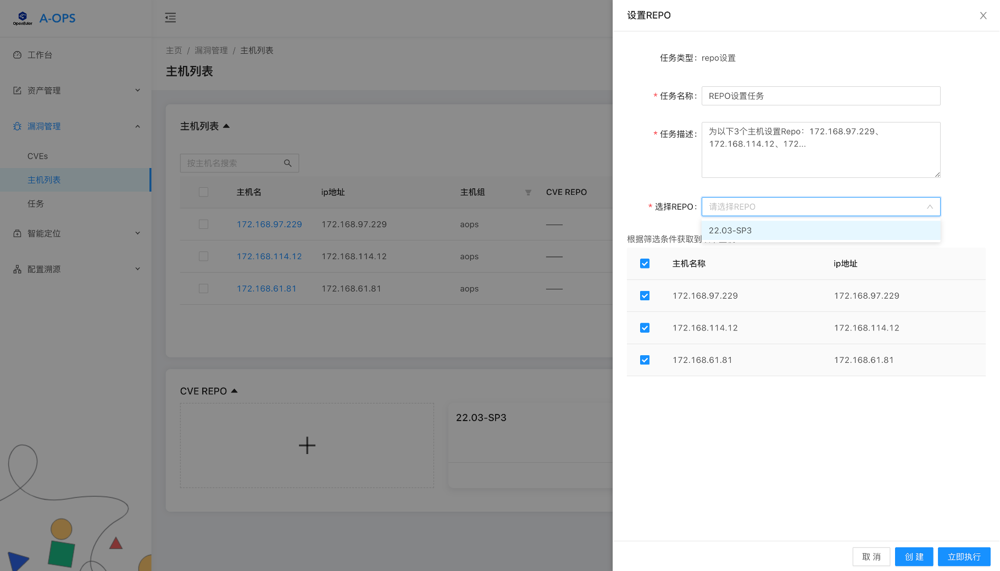

点击“创建”或“立即执行”后会生成一个repo设置任务，执行完毕后即可在主机列表界面看到已设置好该repo源。

## 2. 漏洞扫描

确认好主机上已配置好repo源（或使用默认安装时自带的repo源）后，我们就可以为主机进行批量扫描了。直接点击右侧的漏洞扫描，默认扫描全部主机。用户也可以勾选部分主机进行扫描。

除了手动扫描，用户也可以配置后台定时任务，进行每日定时扫描。

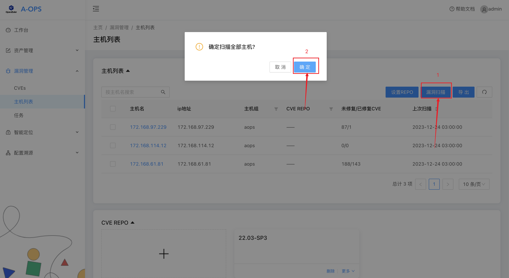

扫描完毕后，若用户在创建用户时配置了邮箱信息，apollo会将漏洞情况邮件发送给用户。

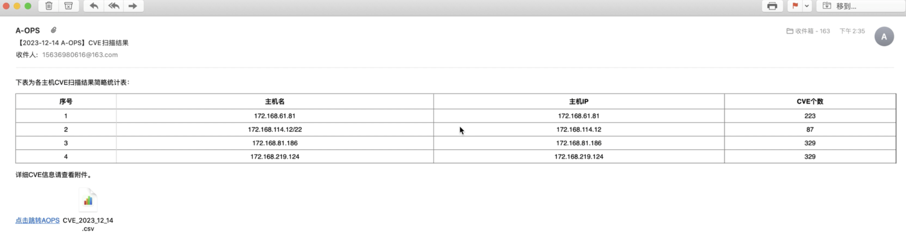

## 3. 漏洞查看

### 3.1 主机详情信息界面

扫描完毕后，除了上文的主机列表可以看到每个主机的已修复和未修复的CVE数量，还可以点击某台主机查看详细的CVE信息：

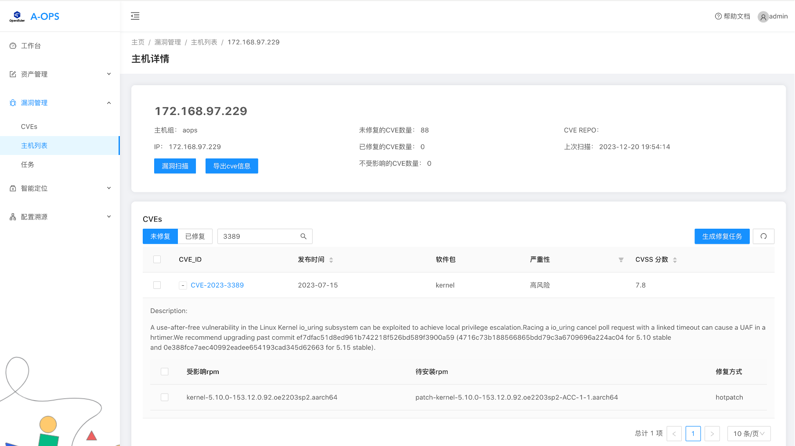

支持如下操作：

- 查看主机基本信息与CVE个数
- 查看该主机未修复CVE和已修复CVE列表，支持导出。未修复CVE展开后可以看到受影响的RPM包及支持的修复方法，已修复CVE展开后可以看到修复使用的RPM。
- 生成CVE修复任务（切换至“未修复”时，才可支持CVE修复任务创建），可支持CVE粒度的任务创建，同时也可具体到特定的rpm包修复
- 生成热补丁移除任务（切换至“已修复”时，才可支持生成热补丁移除任务）
- 单机漏洞扫描

### 3.2 CVE列表界面

上文介绍了从主机维度查看漏洞情况，我们也可以从**漏洞维度**去查看我们重点关注的漏洞。

点击CVEs子页面，可以看到未修复和已修复两个页签，下方详细介绍了每个CVE的发布时间、影响软件包、严重性等信息，展开后则能看到描述信息及受影响的rpm包和支持的修复方式。

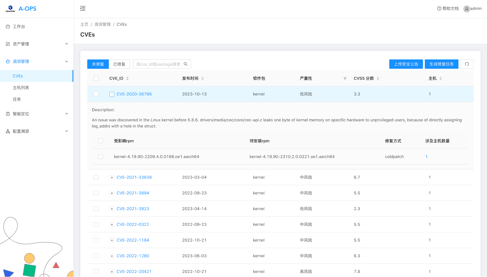

支持如下操作：

- 查看所有CVE信息（CVE严重性进行筛选、CVE ID、发布时间、CVSS分数、主机数量进行排序，可根据CVE ID或软件包名称进行检索）
- 切换至“未修复”列表
    - 展开某CVE可以看到受影响的RPM包和支持的修复方法，以及该组合对应的主机
    - 右侧按钮为“生成修复任务”，支持生成**CVE修复任务**

- 切换至“已修复”列表
    - 展开某CVE可以看到修复使用的RPM及对应的主机
    - 右侧按钮为“热补丁移除”，针对热补丁修复的CVE，可生成**热补丁移除任务**

- 上传安全公告

这里对安全公告的上传简单说明：

apollo支持定时从openEuler官网下载安全公告信息，针对无法连接外网的环境，提供了安全公告的手动上传功能。当前社区仅对社区软件包受影响的CVE发布了安全公告，用户可以从以下地址下载安全公告并上传压缩包：[https://repo.openeuler.org/security/data/cvrf/](https://gitee.com/link?target=https%3A%2F%2Frepo.openeuler.org%2Fsecurity%2Fdata%2Fcvrf%2F)

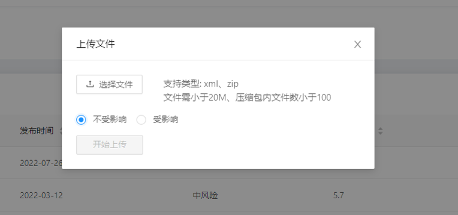

社区也提供了安全公告订阅，订阅后会收到邮件通知：[https://mailweb.openeuler.org/postorius/lists/sa-announce.openeuler.org/](https://mailweb.openeuler.org/postorius/lists/sa-announce.openeuler.org/)

### 3.3 CVE详情信息

和主机详情界面类似，在CVE列表界面点击某一个CVE即可进入CVE详情界面。可以看到此漏洞影响的所有主机和已修复这个漏洞的主机。

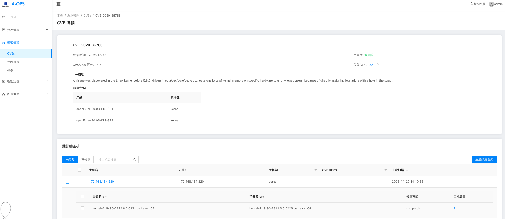

支持如下操作：

- 查看CVE基本信息
- 查看关联CVE数量，即影响同样源码包（如kernel）的CVE
- 查看受此CVE影响的主机列表以及单个主机上受此CVE影响的rpm包列表
- 支持点击主机名称跳转至**主机详情页**
- 选择“未修复”列表，右侧按钮为“生成修复任务，支持**生成CVE修复任务**
- 选择“已修复”列表，右侧按钮为“热补丁移除任务”，支持**生成热补丁移除任务**

## 4. 漏洞修复

### 4.1 生成修复任务

在CVE列表、CVE详情、主机详情界面均可进行漏洞的批量修复。这里以CVE列表界面为示例，选中CVE点击“生成修复任务”按钮，右侧会出现弹窗。不选中CVE则默认修复全部CVE。

其中针对热补丁，有2个按钮：

- 是否accept：勾选后会在重启后自动激活此次修复使用的热补丁

- 冷补丁收编：勾选后，会同步生成热补丁对应的冷补丁的修复任务

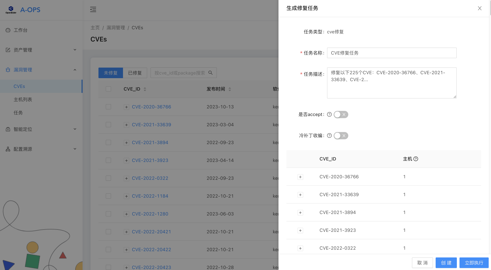

需额外注意：

- 为了方便执行以及后续的任务回滚，生成任务时会自动将冷、热补丁的修复动作拆分成两个任务，可以通过任务名进行分辨。

### 4.2 执行修复任务

生成任务后可以点击立即跳转到该任务详情，或点击左侧的任务子页面，进入任务列表界面：

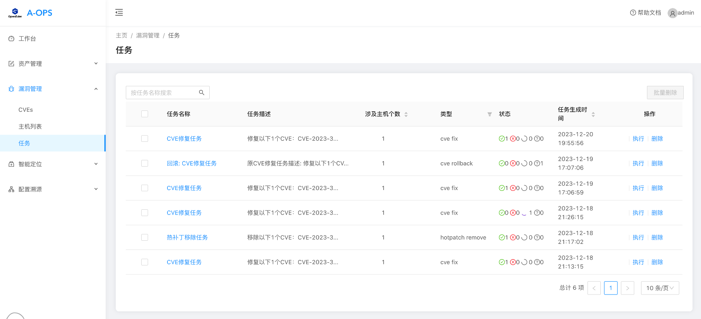

点击刚才生成的修复任务，可以看到此任务的基础信息，以及下方的主机以及该主机要修复的软件包信息。点击右侧的执行按钮即可执行。

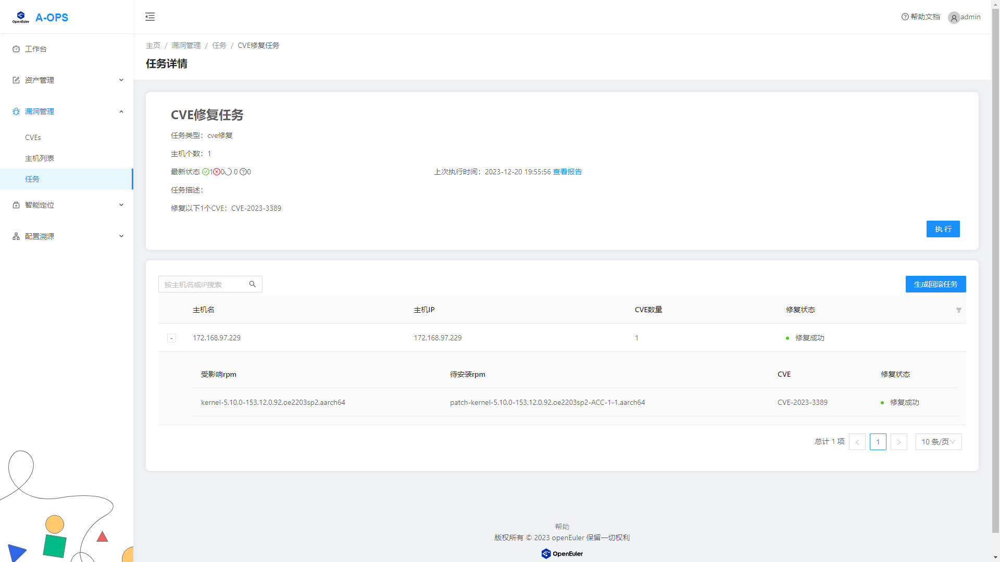

**注意**：针对同一台主机，**热补丁任务应优先与冷补丁任务执行**。由于内核热补丁只能应用在指定版本内核，若先安装冷补丁再安装热补丁，aops客户端会报错，以防重启后内核切换、热补丁失效导致的漏洞重新暴露。而先安装热补丁再安装冷补丁时，客户端调用的dnf upgrade-en 命令会确保冷补丁包含了当前热补丁修复的漏洞。

### 4.3 任务报告查看

执行完毕后，可以看到任务的“上次执行时间”发生更新，并出现“查看报告”按钮。点击查看报告，即可查看各主机的执行情况，如执行结果、执行失败的原因等：

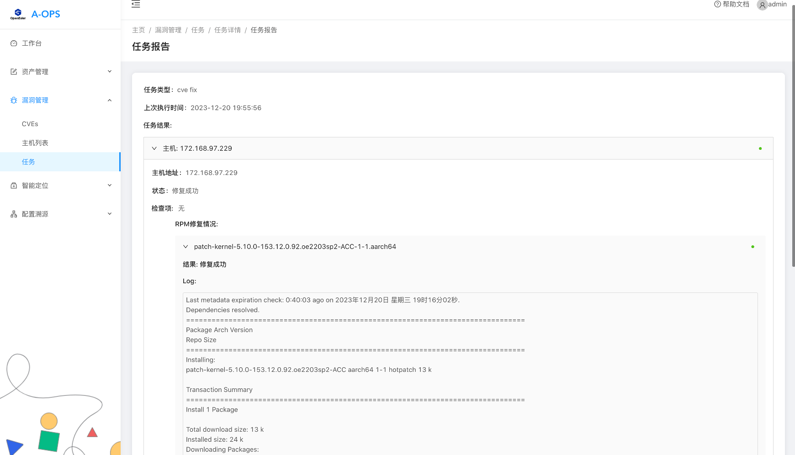

## 5. 修复任务回滚

进入修复任务详情，点击生成回滚任务，即可对该修复任务进行回退：

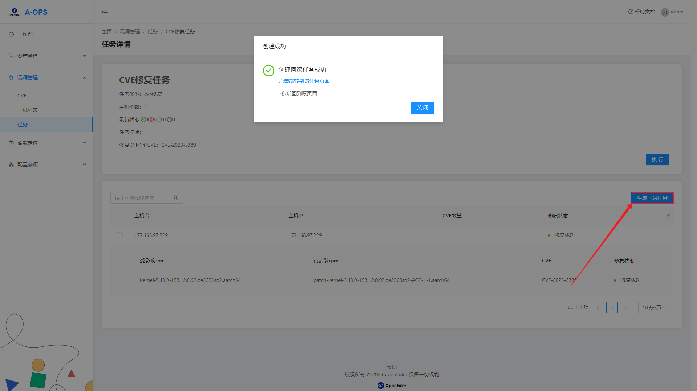

进入回滚任务详情，与修复任务相反，可以看见当前已安装的软件包（修复时安装的rpm），以及回退后的目标软件包（修复前的rpm）。执行时点击“执行”按钮即可。

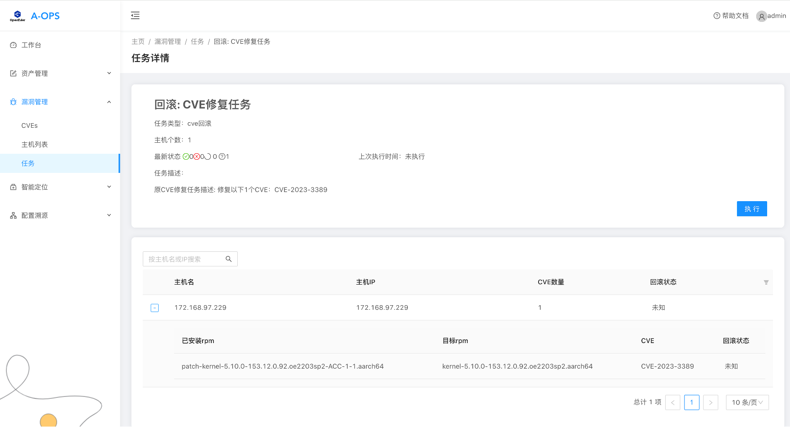

## 6. 热补丁移除任务

若对已安装的热补丁不满意，可以在任意“已修复”的列表，勾选使用热补丁修复的CVE或主机，生成热补丁移除任务。

与回滚任务相比，热补丁移除任务只针对热补丁，且不支持对热补丁的升降级处理，只通过dnf操作将热补丁rpm进行移除。

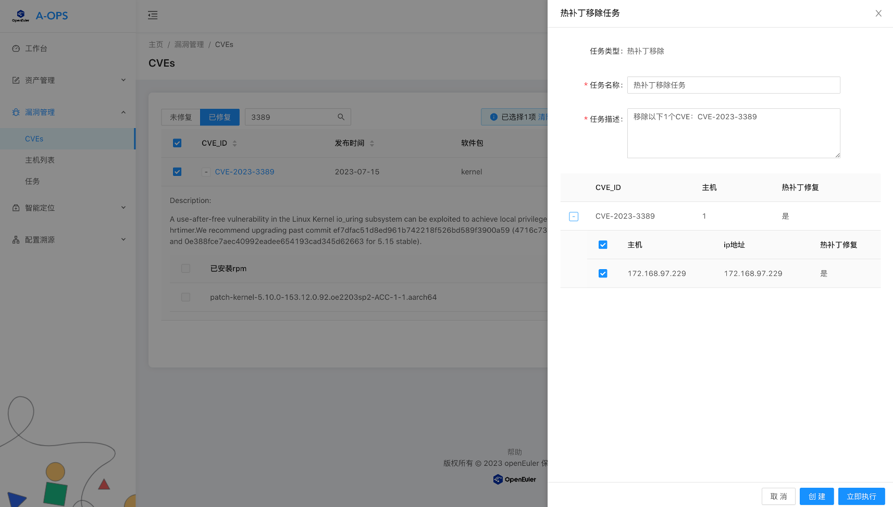

## 7.定时任务配置

主体的漏洞处理过程在前台完成之后，用户还可以在apollo服务端针对后台的定时任务进行编辑，修改后`systemctl restart aops-apollo`重启服务生效。

定时任务主要包含3种类型任务，定时任务配置文件位于 /etc/aops/apollo_crontab.ini，内容如下：

```ini
[cve_scan]
# timed task name
id = cve scan
# value between 0-6, for example, 0 means Monday, 0-6means everyday.
day_of_week = 0-6
# value between 0-23, for example, 2 means 2:00 in a day.
hour = 2
# value is true or false, for example, true means with service start.
auto_start = true

[download_sa]
id = download sa
day_of_week = 0-6
hour = 3
auto_start = true
cvrf_url = https://repo.openeuler.org/security/data/cvrf

[correct_data]
id = correct data
day_of_week = 0-6
hour = 4
auto_start = true
service_timeout_threshold_min = 15
```

### 7.1 定时巡检，执行漏洞扫描

**定时扫描cve任务的参数**

- id

  > 定时任务的名称，不能与其他定时任务名称重复，不建议修改。

- day_of_week

  > 定时任务在一周中的第几天启动，取值范围0-6，0-6表示每天，0表示周一，以此类推。

- hour

  > 任务启动的时间，取值范围0-23，与24小时制时间格式一致。

- auto_start

  > 任务是否跟随服务启动，true表示同时启动，false表示不同时启动。

- 其他

  > 如果要精确到分钟，秒，需要添加minute（取值范围0-59）和second（取值范围0-59）。
  >
  > **示例**
  >
  > ```ini
  > minute = 0
  > second = 0
  > ```

**修改配置文件示例**

> 打开配置文件

```shell
vim /etc/aops/apollo_crontab.ini
```

> 修改定时任务执行时机

```ini
[cve_scan]
id = cve scan
day_of_week = 5
hour = 2
auto_start = true
```

### 7.2  定时下载安全公告

相同字段含义和使用与[cve_scan]一样。

- cvrf_url

  > 获取安全公告详细信息的基础url，**暂不支持修改。**

### 7.3 定时校正异常数据

相同字段含义和使用与[cve_scan]一样。

- service_timeout_threshold_min

  > 判断异常数据的阈值，取值为正整数，建议最小值为15。

**修改配置文件示例**

> 打开配置文件

```shell
vim /etc/aops/apollo_crontab.ini
```

> 设置异常数据阈值

```ini
service_timeout_threshold_min = 15
```
