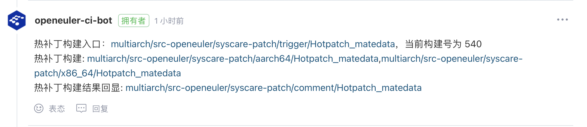

# 社区热补丁制作发布流程

## 制作内核态/用户态热补丁

> 热补丁仓库：<https://gitee.com/openeuler/hotpatch_meta>

### 场景1. 在src-openEuler/openEuler仓下评论pr制作新版本热补丁

> 制作内核态热补丁需在**openEuler/kernel**仓评论pr。
>
> 制作用户态热补丁需在src-openEuler仓评论pr，现在支持**src-openEuler/openssl，src-openEuler/glibc，src-openEuler/systemd**。

#### 1. 在已合入pr下评论制作热补丁

- 从src-openeuler仓【支持openssl, glibc, systemd】评论已合入pr制作新版本热补丁。

```shell
/makehotpatch [软件包版本号] [ACC/SGL] [patch list] [cve/bugfix/feature] [issue id] [os_branch]
```

命令说明：使用多个patch用','分隔，需注意patch的先后顺序。


- 从openeuler仓【支持kernel】评论已合入pr制作新版本热补丁。

```shell
/makehotpatch [软件包版本号] [ACC/SGL] [cve/bugfix/feature] [issue id] [os_branch]
```


评论后，门禁触发hotpatch_meta仓创建热补丁issue以及同步该pr。

#### 2. hotpatch_metadata仓自动创建热补丁issue、同步该pr

pr评论区提示启动热补丁制作流程。


随后，hotpatch_meta仓自动创建热补丁issue，并在hotpatch_meta仓同步该pr。

> 热补丁issue用于跟踪热补丁制作流程。
>
> hotpatch_meta仓用于触发制作热补丁。


点击查看热补丁issue链接内容。


点击查看在hotpatch_meta仓自动创建的pr。


#### 3. 触发制作热补丁

打开hotpatch_meta仓自动创建的pr，评论区可以查看热补丁制作信息。



查看热补丁制作结果。

如果热补丁制作失败，可以根据相关日志信息、下载chroot环境自行修改patch进行调试，重新修改pr提交后或者评论 /retest直到热补丁可以被成功制作。


如果热补丁制作成功，可以通过Download link下载热补丁进行自验。


打开Download link链接。


进入Packages目录，可以下载制作成功的热补丁。


**若热补丁制作成功，可以对热补丁进行审阅**。

### 场景2、从hotpatch_meta仓提pr制作新版本热补丁

> hotpatch_meta仓地址：<https://gitee.com/openeuler/hotpatch_meta>

#### 1. 提pr

在hotpatch_metadata仓提pr。

（1）阅读readme，根据热补丁issue模版和元数据文件hotmetadata_ACC.xml/hotmetadata_SGL.xml模板创建热补丁。


pr内容：

- patch文件。
- 如果没有相应热补丁元数据hotmetadata_ACC.xml/hotmetadata_SGL.xml文件，则手动创建；否则修改热补丁元数据hotmetadata_ACC.xml/hotmetadata_SGL.xml文件。

#### 2. 触发制作热补丁

**若热补丁制作成功，可以对热补丁进行审阅**。

### 场景3、从hotpatch_metadata仓提pr修改热补丁

> hotpatch_meta仓地址：<https://gitee.com/openeuler/hotpatch_meta>
>
> 从hotpatch_meta仓提pr只能修改还未正式发布的热补丁。

#### 1. 提pr

在hotpatch_meta仓提pr。

（1）如果修改过程涉及元数据文件hotmetadata_ACC.xml/hotmetadata_SGL.xml文件内容变动，请阅读readme，按照元数据文件hotmetadata_ACC.xml/hotmetadata_SGL.xml模板进行修改。


> 如果需要修改元数据文件中的热补丁issue字段内容，请确保添加的热补丁Issue已经存在。
> 用户不允许修改热补丁元数据文件中已被正式发布的热补丁的相关内容。

pr内容：

- patch文件。
- 修改热补丁元数据hotmetadata_ACC.xml/hotmetadata_SGL.xml文件。

#### 2. 触发制作热补丁

**若热补丁制作成功，可以对热补丁进行审阅**。

## 审阅热补丁

### 1. 审阅热补丁pr

确认可发布，合入pr。


### 2. pr合入，回填热补丁issue

自动在热补丁issue页面补充热补丁路径，包含src.rpm/arm架构/x86架构的rpm包，以及对应hotpatch.xml，用于展示热补丁信息。

> 如果一个架构失败，强行合入，也可只发布单架构的包。


- 查看热补丁元数据内容。

> 热补丁元数据用于管理查看热补丁相关历史制作信息。

hotmetadata_ACC.xml格式示例：

```xml
<?xml version="1.0" ?>
<ns0:hotpatchdoc xmlns:ns0="https://gitee.com/openeuler/HotPatch_metadata">
    <DocumentTitle xml:lang="en">Managing Hot Patch Metadata</DocumentTitle>
    <HotPatchList>
        <Package name="源码仓库-版本号">
            <hotpatch version="1" release="1" type="修复问题类型[cve/bugfix/feature]" inherit="0" status="unconfirmed">
                <SRC_RPM>源码包下载路径（需要reealse正式路径）</SRC_RPM>
                <Debug_RPM_X86_64>x86_64架构debuginfo包下载路径（需要reealse正式路径）</Debug_RPM_X86_64>
                <Debug_RPM_Aarch64>aarch64架构debuginfo包下载路径（需要reealse正式路径）</Debug_RPM_Aarch64>
                <patch>本次需要制作热补丁的patch包名1</patch>
                <patch>本次需要制作热补丁的patch包名2</patch>
                <patch>...</patch>
                <issue id="cve编号/issue_id" hotpatch_issue_href="需要解决的issue链接"/>
                <issue id="cve编号2/issue_id2" hotpatch_issue_href="需要解决的issue链接2"/>
                <issue.../>
                <hotpatch_issue_link>热补丁issue链接</hotpatch_issue_link>
            </hotpatch>
        </Package>
    </HotPatchList>
</ns0:hotpatchdoc>
```

hotmetadata_SGL.xml格式示例：

```xml
<?xml version="1.0" ?>
<ns0:hotpatchdoc xmlns:ns0="https://gitee.com/openeuler/HotPatch_metadata">
    <DocumentTitle xml:lang="en">Managing Hot Patch Metadata</DocumentTitle>
    <HotPatchList>
        <Package name="源码仓库-版本号">
            <hotpatch name="SGL-issue1-issue2" version="1" release="1" type="修复问题类型[cve/bugfix/feature]" inherit="0" status="unconfirmed">
                <SRC_RPM>源码包下载路径（需要realse正式路径）</SRC_RPM>
                <Debug_RPM_X86_64>x86_64架构debuginfo包下载路径（需要reealse正式路径）</Debug_RPM_X86_64>
                <Debug_RPM_Aarch64>aarch64架构debuginfo包下载路径（需要reealse正式路径）</Debug_RPM_Aarch64>
                <patch>本次需要制作热补丁的patch包名1</patch>
                <patch>本次需要制作热补丁的patch包名2</patch>
                <patch>...</patch>
                <issue id="cve编号/issue_id" hotpatch_issue_href="需要解决的issue链接"/>
                <issue id="cve编号2/issue_id2" hotpatch_issue_href="需要解决的issue链接2"/>
                <issue.../>
                <hotpatch_issue_link>热补丁issue链接</hotpatch_issue_link>
            </hotpatch>
        </Package>
    </HotPatchList>
</ns0:hotpatchdoc>
```

> 注意：src_rpm的download_link均来自openeuler的repo仓下正式发布的rpm包。


### 3. 修改热补丁Issue

- 将热补丁issue状态修改为”已完成“。
- 为热补丁issue添加hotpatch标签。

## 发布热补丁

### 1、收集热补丁发布需求

在release-management仓库每周update需求收集的issue下方，手动评论start-update命令，此时会收集待发布的热补丁和待发布的修复cve的冷补丁。后台会在hotpatch_meta仓库根据hotpatch标签查找已完成的热补丁issue。

### 2、生成热补丁安全公告

社区根据收集到的热补丁issue信息，生成热补丁安全公告xml文件。

> 热补丁安全公告地址：<https://repo.openeuler.org/security/data/hotpatch_cvrf/>

- 在热补丁安全公告文件新增HotPatchTree字段，记录和公告相关漏洞的热补丁，每个补丁按架构和CVE字段区分（Type=ProductName 记录分支，Type=ProductArch 记录补丁具体的rpm包）。


### 3、Majun平台上传文件到openEuler官网，同步生成updateinfo.xml文件

社区将生成的安全公告上传到openEuler官网，同时基于所收集的热补丁信息生成updateinfo.xml文件。


updateinfo.xml文件样例：

```xml
<?xml version="1.0" encoding="UTF-8"?>
<updates>
     <update from="openeuler.org" type="security" status="stable">
          <id>openEuler-HotPatchSA-2023-1001</id>
          <title>An update for kernel is now available for openEuler-22.03-LTS-SP3</title>
          <severity>Important</severity>
          <release>openEuler</release>
          <issued date="2023-09-02"></issued>
          <references>
               <reference href="https://nvd.nist.gov/vuln/detail/CVE-2023-3389" id="CVE-2023-3389" title="CVE-2023-3389" type="cve"></reference>
          </references>
          <description>A use-after-free vulnerability in the Linux Kernel io_uring subsystem can be exploited to achieve local privilege escalation.Racing a io_uring cancel poll request with a linked timeout can cause a UAF in a hrtimer.We recommend upgrading past commit ef7dfac51d8ed961b742218f526bd589f3900a59 (4716c73b188566865bdd79c3a6709696a224ac04 for 5.10 stable and 0e388fce7aec40992eadee654193cad345d62663 for 5.15 stable).(CVE-2023-3389)</description>
          <pkglist>
               <hot_patch_collection>
                    <name>openEuler</name>
                    <package arch="aarch64" name="patch-kernel-5.10.0-153.12.0.92.oe2203sp3-ACC-1-1" release="1" version="1">
                         <filename>patch-kernel-5.10.0-153.12.0.92.oe2203sp3-ACC-1-1.aarch64.rpm</filename>
                    </package>
                    <package arch="x86_64" name="patch-kernel-5.10.0-153.12.0.92.oe2203sp3-ACC-1-1" release="1" version="1">
                         <filename>patch-kernel-5.10.0-153.12.0.92.oe2203sp3-ACC-1-1.x86_64.rpm</filename>
                    </package>
               </hot_patch_collection>
          </pkglist>
     </update>
</updates>
```

### 4、openEuler官网可以查看更新的热补丁信息

> openEuler官网安全公告：<https://www.openeuler.org/zh/security/security-bulletins/>

以”HotpatchSA“关键词搜索热补丁安全公告，打开安全公告查看发布热补丁详细信息。


### 5、获取热补丁相关文件

社区将热补丁相关文件同步至openEuler的repo源下，可以在各个分支的hotpatch_update目录下获取相应文件。
> openEuler的repo地址：<https://repo.openeuler.org/>
