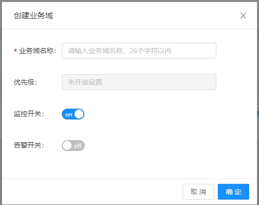
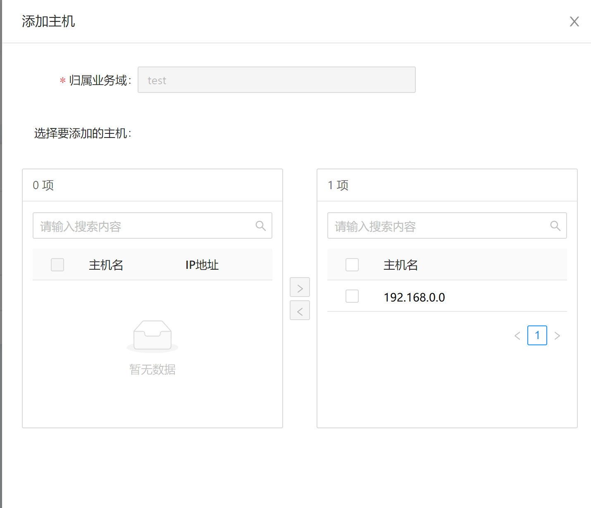
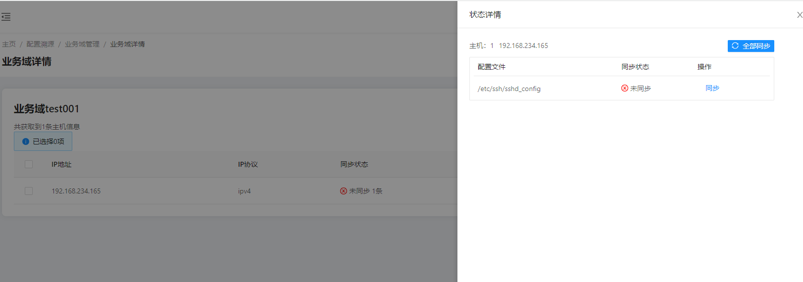
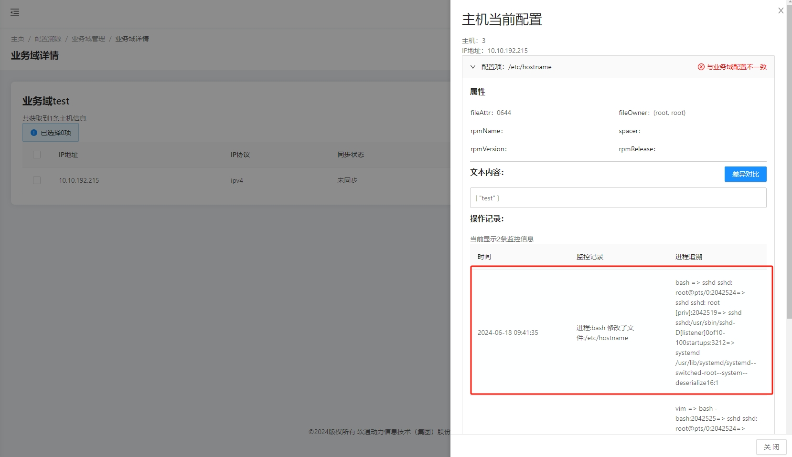

# gala-ragdoll的使用指导

============================

## 安装

### 手动安装

- 通过yum挂载repo源实现

  配置yum源：openEuler-24.03-LTS 和 openEuler-24.03-LTS:Epol，repo源路径：/etc/yum.repos.d/openEuler.repo。

  ```ini
  [everything] # openEuler-24.03-LTS 官方发布源
  name=openEuler-24.03-LTS
  baseurl=https://repo.openeuler.org/openEuler-24.03-LTS/everything/$basearch/ 
  enabled=1
  gpgcheck=1
  gpgkey=https://repo.openeuler.org/openEuler-24.03-LTS/everything/$basearch/RPM-GPG-KEY-openEuler
   
  [Epol] # openEuler-24.03-LTS:Epol 官方发布源
  name=Epol
  baseurl=https://repo.openeuler.org/openEuler-24.03-LTS/EPOL/main/$basearch/ 
  enabled=1
  gpgcheck=1
  gpgkey=https://repo.openeuler.org/openEuler-24.03-LTS/OS/$basearch/RPM-GPG-KEY-openEuler
  ```

  然后执行如下指令下载以及安装gala-ragdoll及其依赖。

  ```shell
  yum install gala-ragdoll # A-Ops 配置溯源
  yum install python3-gala-ragdoll
  
  yum install gala-spider # A-Ops 架构感知
  yum install python3-gala-spider
  ```

- 通过安装rpm包实现。先下载gala-ragdoll-vx.x.x-x.oe1.aarch64.rpm，然后执行如下命令进行安装（其中x.x-x表示版本号，请用实际情况替代）

  ```shell
  rpm -ivh gala-ragdoll-vx.x.x-x.oe1.aarch64.rpm
  ```

### 使用Aops部署服务安装

#### 编辑任务列表

修改部署任务列表，打开gala_ragdoll步骤开关：

```yaml
---
step_list:
 ...
 gala_ragdoll:
   enable: false
   continue: false
 ...
```

#### 编辑主机清单

具体步骤参见[部署管理使用手册]章节2.2.2.10章节gala-ragdoll模块主机配置

#### 编辑变量列表

具体步骤参见[部署管理使用手册]章节2.2.2.10章节gala-ragdoll模块变量配置

#### 执行部署任务

具体步骤参见[部署管理使用手册]章节3执行部署任务

### 配置文件介绍

`/etc/yum.repos.d/openEuler.repo`是用来规定yum源地址的配置文件，该配置文件内容为：

```shell
[OS]
name=OS
baseurl=http://repo.openeuler.org/openEuler-24.03-LTS/OS/$basearch/
enabled=1
gpgcheck=1
gpgkey=http://repo.openeuler.org/openEuler-24.03-LTS/OS/$basearch/RPM-GPG-KEY-openEuler
```

### yang模型介绍

`/etc/yum.repos.d/openEuler.repo`采用yang语言进行表示，参见`gala-ragdoll/yang_modules/openEuler-logos-openEuler.repo.yang`;
其中增加了三个拓展字段：

| 拓展字段名称 | 拓展字段格式           | 样例                                      |
| ------------ | ---------------------- | ----------------------------------------- |
| path         | OS类型：配置文件的路径 | openEuler:/etc/yum.repos.d/openEuler.repo |
| type         | 配置文件类型           | ini、key-value、json、text等              |
| spacer       | 配置项和配置值的中间键 | “ ”、“=”、“：”等                          |

附：yang语言的学习地址：<https://tonydeng.github.io/rfc7950-zh/>

### 通过配置溯源创建域

#### 查看配置文件

gala-ragdoll中存在配置溯源的配置文件。

```shell
[root@openeuler-development-1-1drnd ~]# cat /etc/ragdoll/gala-ragdoll.conf
[git]                                       // 定义当前的git信息：包括git仓的目录和用户信息
git_dir = "/home/confTraceTestConf" 
user_name = "user"
user_email = "email"

[collect]                                  // A-OPS 对外提供的collect接口
collect_address = "http://192.168.0.0:11111"
collect_api = "/manage/config/collect"

[ragdoll]
port = 11114
```

#### 创建配置域



#### 添加配置域纳管node



#### 添加配置域配置


#### 查询预期配置


#### 删除配置


#### 查询实际配置


#### 配置校验


#### 配置同步



#### 配置文件追溯

##### 打开监控开关


##### 配置文件修改记录追溯


